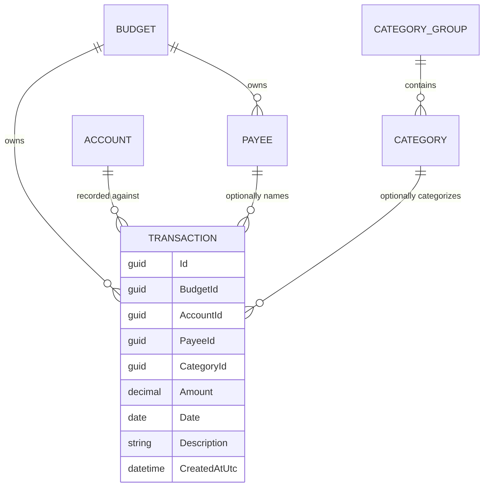

# Transactions

## Table of Contents

- [Purpose](#purpose)
- [Key Entities](#key-entities)
- [Constraints](#constraints)
- [Business Rules & Invariants](#business-rules--invariants)
- [Workflows & State Transitions](#workflows--state-transitions)
- [Decision Trees](#decision-trees)
- [Integration Points](#integration-points)
- [Edge Cases & Known Gotchas](#edge-cases--known-gotchas)

## Purpose

A **Transaction** is a signed amount recorded against one Account on a date. It can
optionally name a **Payee** and select a **Category**. What a transaction does with a payee — supply
a name and get back a row — is documented here; everything about the payee itself is in
[payees.md](payees.md).

## Key Entities

- **Transaction** — `Id`, `BudgetId`, required `AccountId`, signed `Amount`, `Date`, optional
  `Description`, optional `PayeeId`, optional `CategoryId`, `CreatedAtUtc`.


```mermaid
erDiagram
    BUDGET ||--o{ TRANSACTION : owns
    BUDGET ||--o{ PAYEE : owns
    ACCOUNT ||--o{ TRANSACTION : "recorded against"
    PAYEE ||--o{ TRANSACTION : "optionally names"
    CATEGORY ||--o{ TRANSACTION : "optionally categorizes"
    CATEGORY_GROUP ||--o{ CATEGORY : contains
    TRANSACTION {
        guid Id
        guid BudgetId
        guid AccountId
        guid PayeeId
        guid CategoryId
        decimal Amount
        date Date
        string Description
        datetime CreatedAtUtc
    }
```

## Constraints

### MUST

- **The Account must exist and belong to the current budget.**
  - **Why**: The account is what the movement happened to, and it supplies the currency every amount
    on the transaction is displayed in. A transaction against another budget's account would put one
    pool's money into another's picture.
  - **Enforced in**: `CreateTransactionHandler` resolves it through the budget-filtered repository
    and reports "Account was not found." otherwise.

- **A supplied Category must exist and belong to the current budget.**
  - **Why**: Categorization is what the money picture is grouped by, so a category from another pool
    would file this budget's spending under a heading that is not its own.
  - **Enforced in**: `CreateTransactionHandler` resolves `CategoryId` through the budget-filtered
    repository and reports "Category was not found." otherwise.

### MUST NOT

- **Recorded money movement MUST NOT be discarded as a side effect of deleting something else. It is
  discarded only by explicit intent.**
  - **Why**: A transaction is the only data in the system its owner cannot reconstruct from memory.
    Removing one deliberately is a correction — the movement is what the user is aiming at, and a
    ledger that cannot drop a row typed twice holds a movement that never happened. Losing one as
    collateral of a delete aimed at a budget, an account or a category is data loss nobody chose,
    and the user finds out by reading a total that no longer adds up. The distinction between the
    two acts is the whole rule; a difference in the strength of the protection is not what
    separates them.
  - **Enforced in**: **database-owned, with the application supplying the sentences.**
    `TransactionConfiguration` maps `transactions.budget_id → budgets.id` on `Restrict` while the
    four structural tables cascade, so a budget holding any transaction cannot be deleted at all —
    stated once, in [budgets.md](budgets.md#business-rules--invariants). The composite `(account_id,
    budget_id)` and `(category_id, budget_id)` references are `Restrict` too, so an account or a
    category cannot be removed out from under the transactions that name it, whatever wrote the
    delete; `DeleteAccountHandler` and `DeleteCategoryHandler` precheck with `HasTransactionsAsync`
    for the message rather than for the guarantee, per
    [ADR 0002](../decisions/0002-enforce-rules-at-the-lowest-capable-layer.md). The one path that
    removes recorded movement is a delete aimed at the transaction itself, which is a rule of its
    own under [Business Rules & Invariants](#business-rules--invariants).

- **A Payee referenced by any Transaction MUST NOT be deleted.** The Transaction's existence is what
  makes the rule bite; the rule itself, its reasoning and its enforcement are stated once, in
  [payees.md](payees.md#must-not).

## Business Rules & Invariants

- **Rule**: The sign of Amount encodes direction — negative is an expense, positive is income. Zero
  is neither, and is a valid transaction.
- **Why**: The net effect on an account is then simply the sum of its amounts, and a "positive
  expense" contradiction is structurally impossible. Zero is legal because a ledger records what
  happened, not only where money moved: a fully discounted purchase, a refund that exactly cancels
  the purchase it reverses, or a zero-value invoice is a real event whose worth is its date, payee
  and category rather than its magnitude. Refusing it would not remove the event — it would force the
  user to invent an amount or drop the entry, and both store something less true than zero.
- **Enforced in**: nothing enforces the meaning; it is a semantic convention. `Transaction.Create`
  enforces only precision and magnitude, so no validation reads the sign at all.
- **Example**: groceries costing £40 are `-40.00`; a £1,500 paycheck is `1500.00`; an order that a
  voucher covered in full is `0`.
- **Counterexample**: recording an expense as `40.00` because the form already labels the row an
  expense makes the account's total climb with every purchase. Nothing rejects it — no validation
  reads the sign — so the mistake never surfaces as an error, only as a total nobody can explain.
- **Source**: `[SOURCE: discussion — 2026-07-28]`

---

- **Rule**: Amount has at most as many decimal places as its Account's currency has minor units, and
  an absolute value of at most 1,000,000,000.
- **Why**: Precision belongs to the currency rather than to the column — a yen has no sub-unit, a
  dinar has three — so a place beyond what the currency has implies a rounding or entry error rather
  than a smaller amount. The cap is a sanity bound against fat-finger entries.
- **Enforced in**: split by layer for the same reason as the identical rule on
  [accounts](accounts.md#business-rules--invariants). `CK_transactions_amount`
  (`abs(amount) <= 1000000000`) owns the magnitude bound, so it holds whatever wrote the row.
  `Transaction.Create` owns the decimal-places half alone, against the minor unit
  `CreateTransactionHandler` resolved from the Account's currency, and restates the magnitude bound
  for the message. That half has nowhere lower to go twice over: `numeric(14,4)` rounds an
  over-precise amount rather than refusing it, and a coercion is not enforcement under
  [ADR 0002](../decisions/0002-enforce-rules-at-the-lowest-capable-layer.md), while a check
  constraint cannot read the currency's precision without joining another table. The reasoning is in
  [currencies.md](currencies.md#business-rules--invariants).
- **Example**: on a USD account `-40.00` is accepted and `10.005` is rejected as too precise; on a
  JPY account `-4000` is accepted and `-40.5` is rejected as not a whole number; `2000000000` is
  rejected as over the cap in any currency.
- **Source**: `[SOURCE: discussion — 2026-07-28]`

---

- **Rule**: Description is optional, a blank value is stored as null, and a value is at most 500
  characters.
- **Why**: The description is a free-text memo, so an empty string and "no memo" are the same thing
  and should not be two states a reader has to handle.
- **Enforced in**: `Transaction.Create`.
- **Example**: `"   "` is stored as null, not as a blank string.
- **Source**: `[SOURCE: discussion — 2026-07-26]`

---

- **Rule**: A Transaction may be uncategorized, even though every Category's own `CategoryGroupId` is
  required.
- **Why**: Recording that money moved must never be blocked on deciding what it was for — the entry
  has to stay fast enough to do at the till. An unfiled Category, by contrast, has no such excuse:
  the hierarchy is arranged deliberately, not in a hurry.
- **Enforced in**: `Transaction.CategoryId` is nullable; `CreateTransactionHandler` resolves a
  category only when one is supplied.
- **Example**: a `-12.50` corner-shop transaction with no category is valid and appears in lists with
  an empty category column.
- **Source**: `[SOURCE: discussion — 2026-07-14]`

---

- **Rule**: A Transaction may name a Payee or none, and the Payee is supplied as a free-text **name**
  while the Category is supplied as an existing **id**.
- **Why**: The asymmetry follows from when each is chosen. The counterparty is typed mid-entry, and
  making the user create one first would slow down the entry the model most needs to keep fast; the
  category is picked from a list they arranged deliberately, where a name would be a second way to
  say something they can already point at. Both are optional for the same reason a Transaction may be
  uncategorized: recording that money moved must never be blocked on describing it.
- **Enforced in**: `CreateTransactionCommand` carries a nullable `PayeeName` and a nullable
  `CategoryId`; `Transaction.PayeeId` is nullable and set only through `AssignPayee`.
  `CreateTransactionHandler` turns the name into a row by calling `IPayeeRepository.GetOrCreateAsync`
  in the ambient budget. What that call does with the name — trimming, case-insensitive matching,
  what a blank name means, and what happens when two requests race — is documented in
  [payees.md](payees.md#business-rules--invariants).
- **Example**: a transaction submitted with `payeeName: "tesco"` comes back carrying the `payeeId`
  and the stored spelling `Tesco` of the payee that already existed.
- **Source**: `[SOURCE: discussion — 2026-07-13]`

---

- **Rule**: Categorization is selected by Category ID only. Category Group is derived from the
  selected Category and is not copied onto the Transaction.
- **Why**: Storing the group too would let the two disagree the moment a Category is moved to another
  group, and there is no question the stored group could answer that the Category cannot.
- **Enforced in**: `CreateTransactionCommand` carries `CategoryId`; `Transaction` has no
  `CategoryGroupId`.
- **Example**: moving "Groceries" from "Essential Obligations" to "Household" changes what every past
  grocery transaction displays as its group, with no transaction rows written.
- **Counterexample**: copying `CategoryGroupId` onto the Transaction makes the two disagree the
  moment the Category moves — the transaction keeps naming the old heading while the category list
  shows the new one, and no read can tell which of the two was meant.
- **Source**: `[SOURCE: discussion — 2026-07-14]`

---

- **Rule**: Transaction responses are self-contained for display — they carry `CategoryId`,
  `CategoryName`, `CategoryGroupId` and `CategoryGroupName`, plus the account's name, currency code
  and symbol.
- **Why**: A transaction list has to render an amount and its context without the client stitching
  together three other endpoints, and the projection is from current data so a rename shows up
  immediately.
- **Enforced in**: `TransactionDto.FromTransaction`, fed by the handler's resolved account, currency,
  payee, category and category group.
- **Example**: renaming an account is visible in the transaction list on the next read, because the
  name is joined rather than snapshotted.
- **Source**: `[SOURCE: discussion — 2026-07-26]`

---

- **Rule**: A Transaction can be deleted by id by the owner of the budget that holds it. The row is
  removed outright — there is no voided, archived or flagged state — and the response is 204 No
  Content. An id that belongs to another budget answers 404, exactly as an id that never existed
  does.
- **Why**: Every entry is typed by hand, so the ledger carries hand-made mistakes: a purchase
  recorded twice because the first attempt looked like it failed, an amount entered against the
  wrong account, a figure fat-fingered by a decimal place. Removing such a row is the correction,
  not the loss — what money movement is protected from is being discarded as collateral, and this is
  the one act where the movement is what the user is aiming at. The removal is **hard, not flagged,**
  because a flag would buy nothing this product has asked for: nothing restores a deleted row, there
  is no trash to restore it from, no second person whose view of the row has to be reconciled, no
  retention requirement, and no soft-delete anywhere else in the schema to be consistent with. What
  it would cost is a predicate on every transaction query, a second filter interacting with
  `BudgetIsolation`, and a row still sitting in storage after the user asked for it to be gone —
  against a product that promises complete erasure.
- **Enforced in**: **application-owned, and necessarily so** — no constraint can express that a row
  *may* go, and there is no lower layer for a permission to live in. `TransactionEndpoints` maps
  `DELETE /api/transactions/{id:guid}` and returns `TypedResults.NoContent()`.
  `DeleteTransactionHandler` resolves the id through `ITransactionRepository.GetByIdAsync` and
  throws `NotFoundException` on a miss, which `NotFoundExceptionHandler` renders as a 404
  `ProblemDetails`; the 404-rather-than-403 answer for another budget's row is the standing tenancy
  rule, stated once in [budgets.md](budgets.md#must-not). `TransactionRepository.GetByIdAsync`
  queries the `BudgetIsolation`-filtered `DbSet` rather than `Find`, because `Find` can answer from
  the change tracker without ever reaching the filter. `TransactionRepository.DeleteAsync` removes
  the row and saves, with no exception translation and no precheck behind it: nothing in the schema
  references `transactions`, so a delete has no foreign key to violate and there is no `23503` to
  turn into a sentence — unlike `AccountRepository.DeleteAsync` and
  `CategoryRepository.DeleteAsync`.
- **Example**: a `-40.00` grocery entry recorded twice is deleted once; the response carries no
  body, the surviving entry is untouched, and repeating the same delete answers 404.
- **Counterexample**: flagging the row deleted and filtering it out on read. Every query over
  transactions then carries a second predicate beside the budget filter, and the first one that
  forgets it puts the row back into the list the user thought they had corrected — silently, because
  it still exists and still satisfies every constraint. The delete guards on accounts and categories
  would have to be taught about the flag too, or an account would stay undeletable on the strength
  of transactions the user has already removed.
- **Source**: `[SOURCE: discussion — 2026-07-29]`

## Workflows & State Transitions

A Transaction has no lifecycle states and therefore no state machine: it is created, read, and
eventually deleted whole. Nothing transitions it — there is no update path (see Edge Cases), and the
delete leaves no state behind to move to. The branching that exists is in creation and in resolving
the id to delete, both below.

## Decision Trees

Creating a transaction (`CreateTransactionHandler`):

```
IF the account id does not resolve in the ambient budget
  THEN validation error "Account was not found."          ← also the cross-budget answer
ELSE IF the account's currency code has no seeded Currency row
  THEN InvalidOperationException                          ← unreachable; the currency FK forbids it
ELSE
  Transaction.Create validates the amount's precision against that currency's minor unit,
    its magnitude, and the description length
  IF a CategoryId was supplied
    IF it does not resolve in the ambient budget
      THEN validation error "Category was not found."
    ELSE resolve its Category Group and assign the category
  IF a PayeeName was supplied and is not blank
    THEN find-or-create the payee in the ambient budget and assign it
  THEN persist and return the self-contained response
```

The category and payee steps are independent — either, both, or neither may run.

Deleting a transaction (`DeleteTransactionHandler`):

```
IF the transaction id does not resolve in the ambient budget
  THEN 404 "Transaction was not found."                   ← also the cross-budget answer
ELSE
  THEN remove the row                                     ← nothing references a transaction,
                                                            so there is no guard to run first
```

## Integration Points

- **[Accounts](accounts.md)**: required target; its Currency determines both the precision an amount
  may carry and how it is displayed. It cannot be deleted while Transactions reference it, and
  deleting the last Transaction that named it is what clears that refusal — which is what makes
  "Account cannot be deleted because it has transactions." an instruction the user can follow rather
  than a dead end.
- **[Categories and Category Groups](categories.md)**: optional Category context. A referenced
  Category cannot be deleted; its Category Group cannot be deleted while the Category exists.
  Deleting the last Transaction filed under a Category clears the first refusal the same way, and
  emptying the Category out of its group clears the second.
- **[Payees](payees.md)**: optional counterparty, and the only thing a Transaction can bring into
  existence. Transaction creation is the sole writer of the `payees` table, and a Transaction that
  references a payee is what makes that payee undeletable. The relationship is one-way: deleting the
  Transaction does not remove the payee it created, and nothing else will either.
- **[Budgets](budgets.md)**: Transactions, Payees, Accounts, Categories and Category Groups are
  budget-filtered, and the `transactions → accounts | categories | payees` references are composite
  foreign keys so PostgreSQL, not only the query filter, refuses a cross-budget reference. Both rules
  and their reasoning live in [budgets.md](budgets.md#constraints). A Transaction's existence is also
  what makes its Budget undeletable, unlike the Budget's other owned entities — the budget-level
  half of the never-as-a-side-effect rule stated under [Constraints](#must-not) above.

## Edge Cases & Known Gotchas

- **A Transaction cannot be edited, and that is the shape of the implementation rather than a
  business rule.** No update command, handler or endpoint exists, and `Transaction` exposes no
  mutator beyond `AssignPayee` and `AssignCategory`, which only creation calls. Do not cite the
  absence of an edit path as a constraint, and do not build behaviour that relies on a stored
  transaction never changing. Deletion is a different matter — it is built, and it *is* a rule; see
  [Business Rules & Invariants](#business-rules--invariants) above. Correcting an entry therefore
  means deleting it and recording it again.
- **Deleting a Transaction can strand its Payee, permanently.** The payee row stays behind and
  nothing removes it — there is no delete path for payees at all — so a counterparty named only on
  a transaction that was then deleted sits in the autocomplete list forever. This is accepted rather
  than overlooked, and it is the only route to the state
  [payees.md](payees.md#edge-cases--known-gotchas) describes: the existence of a payee is not
  evidence that any transaction ever named it.
- **The account and category delete guards are racy in both directions, and their foreign-key
  catches are what actually holds.** `DeleteAccountHandler` and `DeleteCategoryHandler` ask
  `HasTransactionsAsync` before removing the row, and either answer can be stale by the time the
  delete runs: "no transactions" can be invalidated by a concurrent insert, and "has transactions"
  by a concurrent delete. The first direction lands on the constraint, which is why
  `AccountRepository.DeleteAsync` and `CategoryRepository.DeleteAsync` catch `23503` **by constraint
  name** and translate it; the second fails safe, as a refusal the user clears by asking again.
  Under [ADR 0002](../decisions/0002-enforce-rules-at-the-lowest-capable-layer.md) that split is the
  intended one — the precheck exists for the *message*, the foreign key is what is *correct* — so
  neither catch is redundant cover over a check that already passed. Do not simplify either away,
  and do not close the race with a lock.
- **An untouched amount field is a zero, and only the client can tell the two apart.** An empty
  numeric input binds to `0`, so a form submitted with nothing typed records a perfectly valid zero
  transaction. The domain cannot refuse it without refusing the deliberate zeros the sign rule above
  allows, and the database knows even less, so the guard is the form's: **the amount input MUST
  require a value rather than default to one.** Under
  [ADR 0002](../decisions/0002-enforce-rules-at-the-lowest-capable-layer.md) that is the right layer
  — the rule is about the interaction, not about what a ledger may hold — but it is also the only
  layer holding it, with nothing underneath to catch a client that forgets.
- **Creating a transaction that names a new payee writes two rows, and both go in one database
  transaction.** `CreateTransactionHandler` runs the payee find-or-create and the transaction insert
  inside `ITransactionalExecutor`, so a failure between them commits neither. The boundary is
  load-bearing rather than tidy: payees have no delete path, so a payee committed without its
  transaction would be permanent litter (see [payees.md](payees.md#edge-cases--known-gotchas)), and
  a client disconnect is enough to reach that point — the handler's `CancellationToken` is the
  request's `RequestAborted`. It starts *after* the account, currency and category lookups, which
  commit nothing and would only hold the connection and its locks longer. Do not narrow it, and do
  not widen it to the whole handler; the reasoning, including why the begin/commit pair has to run
  through the provider's execution strategy, is in
  [ADR 0003](../decisions/0003-wrap-multi-repository-writes-in-one-transaction.md).
- Renaming a Category or Category Group, or moving a Category, immediately changes historical
  Transaction display; see [categories.md](categories.md#edge-cases--known-gotchas).
- A missing Currency row for an Account fails loudly rather than guessing a symbol, but the
  `accounts.currency_code` foreign key means it cannot happen — see
  [currencies.md](currencies.md#edge-cases--known-gotchas).
- `Date` is a calendar date with no timezone. `CreatedAtUtc` is the separate audit timestamp.
