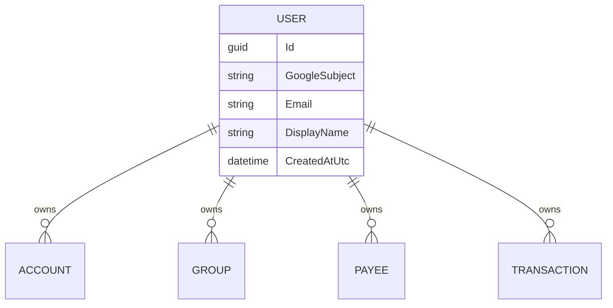
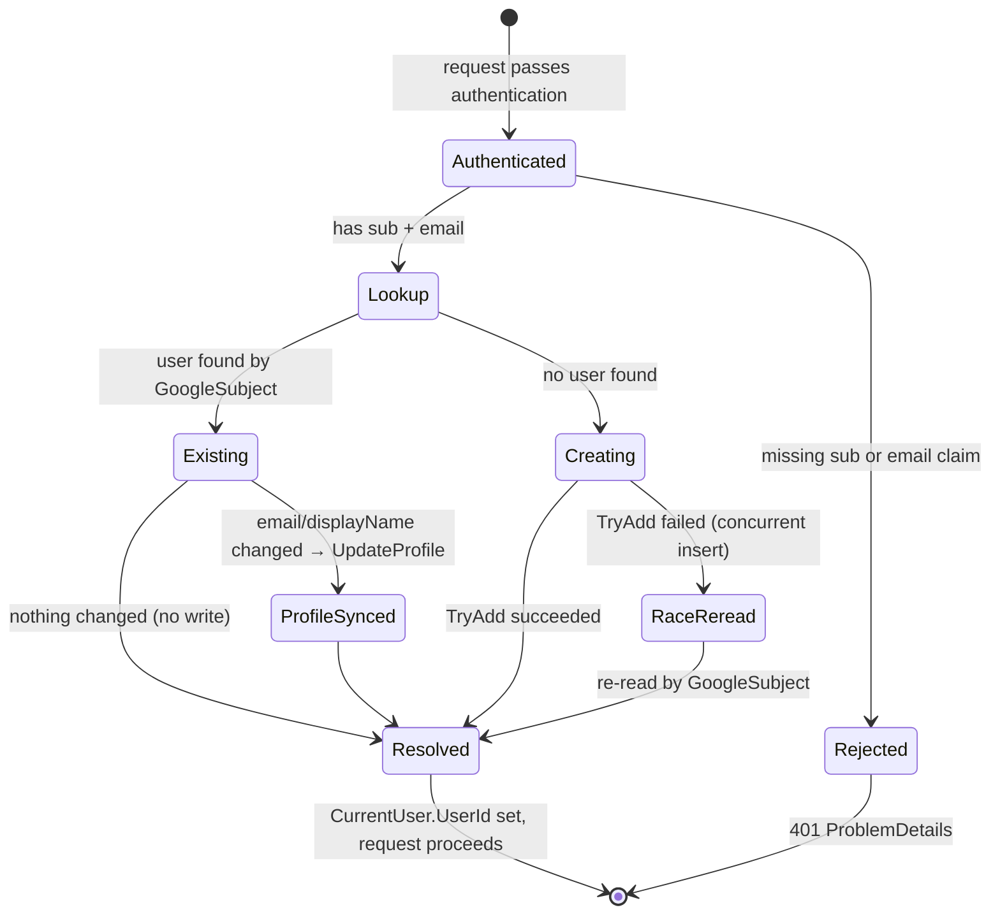

# Users & Ownership

## Table of Contents

- [Purpose](#purpose)
- [Key Entities](#key-entities)
- [Constraints](#constraints)
- [Business Rules & Invariants](#business-rules--invariants)
- [Workflows & State Transitions](#workflows--state-transitions)
- [Integration Points](#integration-points)
- [Edge Cases & Known Gotchas](#edge-cases--known-gotchas)

## Purpose

This area covers **who a user is** and the single most important rule in the whole system:
**a user can only ever see or change their own data.** Users are not registered through a form —
they are provisioned transparently from their Google sign-in on their first authenticated request.
The ownership invariant defined here is cross-cutting: every rule in
[accounts.md](accounts.md), [transactions.md](transactions.md), and [groups.md](groups.md) assumes
it, and none of those areas re-document it.

## Key Entities

- **User** — the account owner. Identified externally by `GoogleSubject` (the Google OAuth `sub`
  claim, stable and immutable), internally by a `Guid Id`. Carries an `Email` and an optional
  `DisplayName`.
- **Email** — a value object wrapping the email string. Two emails are equal iff their values are
  equal (used to detect profile changes).

## Constraints

### MUST

- **Every user-owned entity is scoped to exactly one user, on both read and write.**
  - **Why**: This is a multi-tenant app with a single shared database. If isolation leaked, one
    person could read or modify another person's finances — the worst possible failure for a money
    app.
  - **Enforced in**: EF Core global query filters named `UserIsolation` in
    `BudgetoidApp/Infrastructure/Persistence/BudgetoidDbContext.cs` (applied to `Transaction`,
    `Account`, `Payee`, `Group`), plus `UserId` stamping at creation from `IUserContext.UserId` in
    each create handler / `Account.Create`, `Group.Create`, `Transaction.Create`,
    `PayeeRepository.GetOrCreateAsync`.

- **A request must resolve to a real internal user before it can touch data.**
  - **Why**: Handlers stamp and filter by `IUserContext.UserId`; without a resolved user there is
    no tenant to scope to.
  - **Enforced in**: `BudgetoidApp/Api/Infrastructure/UserProvisioningMiddleware.cs` populates
    `CurrentUser.UserId`; `HttpContextUserContext` throws
    `"The current application user has not been resolved."` if it is still null.

- **An authenticated principal must carry `sub` and `email` claims.**
  - **Why**: `sub` is the stable identity key we upsert on; `email` is a required profile field.
    Without them we cannot provision a user.
  - **Enforced in**: `UserProvisioningMiddleware` returns `401` (ProblemDetails, "missing required
    claims") when either is absent.

### MUST NOT

- **A user MUST NOT be able to load, update, or delete another user's account, transaction, payee,
  or group.**
  - **Why**: Same as the isolation constraint above — cross-tenant access is a security breach.
  - **Enforced in**: the `UserIsolation` query filter makes another user's row resolve to `null`,
    so `GetByIdAsync` returns nothing and update/delete handlers throw `NotFoundException` (404) —
    the caller cannot even distinguish "not yours" from "does not exist".

## Business Rules & Invariants

- **Rule**: A user is provisioned (or their profile synced) idempotently on sign-in, keyed on the
  Google `sub`.
- **Why**: There is no registration step. The first authenticated request must create the internal
  user; subsequent requests must find the same one and keep email/display name fresh, without ever
  creating duplicates.
- **Enforced in**: `EnsureUserHandler` (`Application/Users/EnsureUser/EnsureUserHandler.cs`),
  invoked by `UserProvisioningMiddleware`.
- **Example**: A returning user whose Google display name changed from "Sam" to "Samantha" — on her
  next request the handler finds her by `sub`, sees the display name differs, and updates the
  profile. If nothing changed, no write happens.
- **Counterexample**: Keying on `email` instead of `sub` would break if the user changed their
  Google email — they'd be provisioned as a brand-new user and lose access to all their data.
- **Source**: `[SOURCE: code-audit]`

---

- **Rule**: `GoogleSubject` is immutable after creation; `Email` and `DisplayName` can change.
- **Why**: `sub` is the identity anchor — changing it would sever the user from their data. Email
  and name are mutable profile attributes that Google may update.
- **Enforced in**: `User.UpdateProfile(email, displayName)` sets email/name only;
  `Domain/Users/User.cs` has no setter path for `GoogleSubject` after `Create`.
- **Example**: `UpdateProfile` re-runs `Email.Create`, so a blanked email would be rejected.
- **Source**: `[SOURCE: code-audit]`

---

- **Rule**: An email must be present (non-blank, trimmed). Format is **not** validated.
- **Why**: The email comes from a trusted Google ID token, which has already verified it — a regex
  check would add friction without adding trust. Presence is still required because it's a
  displayed, required profile field.
- **Enforced in**: `Domain/Users/Email.cs` (`Email.Create`).
- **Source**: `[SOURCE: code-audit]`

## Workflows & State Transitions

**User provisioning on an authenticated request** (`UserProvisioningMiddleware` → `EnsureUserHandler`):

| Transition | Triggered by | Validations |
|---|---|---|
| Authenticated → Rejected | Auth succeeds but claims missing | `sub` and `email` both required, else 401 |
| Lookup → Existing | User found by `GoogleSubject` | — |
| Existing → ProfileSynced | Email or display name differs | `UpdateProfile` re-validates email presence |
| Existing → Resolved | Nothing changed | Dirty check skips the write |
| Creating → Resolved | New user inserted | `User.Create` validates `sub`/email |
| Creating → RaceReread → Resolved | Unique-insert race | Re-read by `sub`; throws if still absent |

## Integration Points

- **Google OAuth / OIDC**: identity comes from the Google ID token. The API trusts the `sub`,
  `email`, and optional `name` claims. The frontend attaches the **ID token** (not the access
  token) as the `Authorization: Bearer` header on API calls (see the client `AuthInterceptor`).
- **All other domain areas**: Accounts, Transactions, Payees, and Groups depend on the ownership
  invariant defined here — they stamp `UserId` on create and are filtered by it on read.

## Edge Cases & Known Gotchas

- **Concurrent first-request race**: two simultaneous first requests for the same new user can both
  miss on lookup and race to insert. The loser of the unique-index race catches the failure and
  re-reads by `sub` rather than erroring. Do not "simplify" `EnsureUserHandler` by dropping the
  re-read — it is what makes provisioning safe under concurrency.
- **`IUserContext` is optional on the DbContext**: design-time/migration/seeding paths construct the
  context without a resolved user. That's intentional — those paths never query the isolation-filtered
  entities. Application request paths always have a resolved user.
- **404, not 403, for another user's row**: because isolation is a query filter, "belongs to someone
  else" is indistinguishable from "doesn't exist". This is deliberate (it avoids leaking the
  existence of other users' records), so don't add a separate 403 path.
