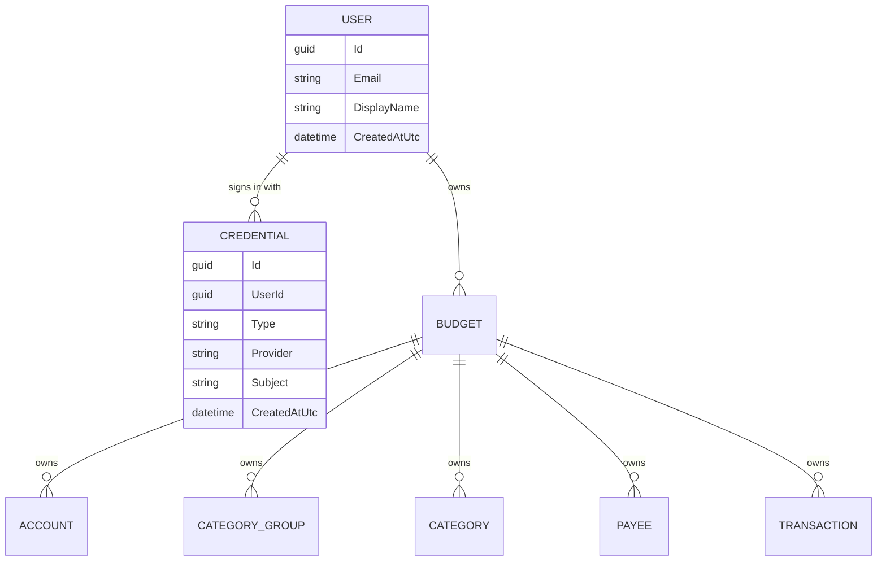
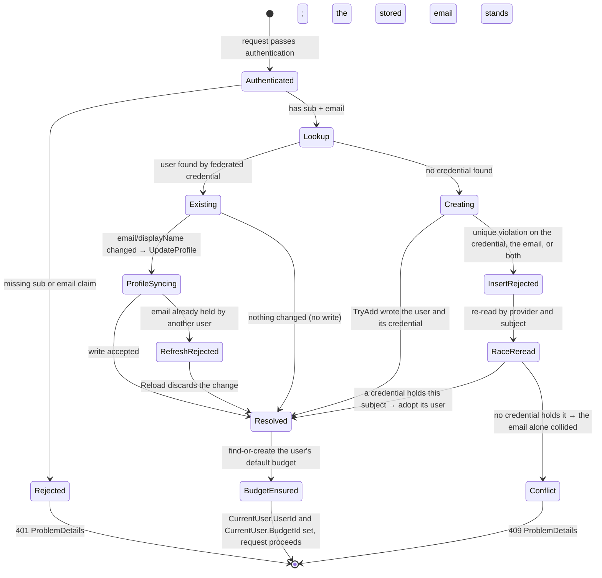

# Users & Ownership

## Table of Contents

- [Purpose](#purpose)
- [Key Entities](#key-entities)
- [Constraints](#constraints)
- [Business Rules & Invariants](#business-rules--invariants)
- [Workflows & State Transitions](#workflows--state-transitions)
- [Decision Trees](#decision-trees)
- [Integration Points](#integration-points)
- [Edge Cases & Known Gotchas](#edge-cases--known-gotchas)

## Purpose

This area covers **who a user is** and how that identity comes to exist. Users are not registered
through a form — they are provisioned transparently from their Google sign-in on their first
authenticated request.

A user owns **Budgets** and nothing else. Everything else — accounts, category groups, categories,
payees, transactions — belongs to a budget, so **the budget, not the user, is the unit of tenancy.**
That invariant and the isolation rules that implement it live in [budgets.md](budgets.md); this area
does not duplicate them. What it does own is the identity, its claims, and the provisioning step that
resolves a Google principal into an internal user together with the ambient budget for the request.

## Key Entities

- **User** — the account owner, identified by a `Guid Id` no external party supplies. It carries no
  identity key of its own: every way of signing in is a **Credential** row instead. Holds an `Email`
  and an optional `DisplayName` of at most `User.MaxDisplayNameLength` = 200 characters, both cached
  copies of what the identity provider supplied.
- **Credential** — one way of signing in to an account, carrying exactly one `CredentialType`:
  `Federated` (an external provider vouches for the user) or `Passkey` (the authenticator holds it,
  and no external party is involved). A federated credential names its `Provider` (at most
  `Credential.MaxProviderLength` = 50 characters; `google` is the only one today) and the provider's
  `Subject` — the OAuth `sub` claim, stable and at most `Credential.MaxSubjectLength` = 255
  characters. A passkey credential carries neither. An account may hold more than one credential;
  registering and revoking them is not built yet, so today every account is created with exactly one
  federated Google credential.
- **Email** — a value object wrapping the email string; required, trimmed, and at most
  `Email.MaxLength` = 254 characters. Two `Email` values are equal iff their strings are equal, which
  is what the profile dirty check compares. Uniqueness is a **wider** comparison than that equality:
  `users.email` carries a unique index on the `case_insensitive` collation, so at most one user row
  holds a given address whatever its casing.


```mermaid
erDiagram
    USER ||--o{ CREDENTIAL : "signs in with"
    USER ||--o{ BUDGET : owns
    BUDGET ||--o{ ACCOUNT : owns
    BUDGET ||--o{ CATEGORY_GROUP : owns
    BUDGET ||--o{ CATEGORY : owns
    BUDGET ||--o{ PAYEE : owns
    BUDGET ||--o{ TRANSACTION : owns
    USER {
        guid Id
        string Email
        string DisplayName
        datetime CreatedAtUtc
    }
    CREDENTIAL {
        guid Id
        guid UserId
        string Type
        string Provider
        string Subject
        datetime CreatedAtUtc
    }
```

## Constraints

### MUST

- **Data isolation is scoped to a budget, not to a user.** The MUST/MUST NOT rules that define it —
  every account, category group, category, payee and transaction belonging to exactly one budget,
  per-budget name uniqueness and ordering, no response combining budgets — are documented once, in
  [budgets.md](budgets.md#constraints). A user reaches their data only through the budget they own, so
  "a user can only see their own data" is a consequence of budget isolation rather than a separate
  rule.

- **A request must resolve to a real internal user and an ambient budget before it can touch data.**
  - **Why**: Handlers stamp and filter by `IBudgetContext.BudgetId`; without a resolved budget there
    is no tenant to scope to, and a default value would silently point at nothing.
  - **Enforced in**: `BudgetoidApp/Api/Infrastructure/UserProvisioningMiddleware.cs` populates both
    `CurrentUser.UserId` and `CurrentUser.BudgetId`; `HttpContextBudgetContext` surfaces the second as
    `IBudgetContext.ResolvedBudgetId`, and the strict `IBudgetContext.BudgetId` derived from it throws
    `"The ambient budget for the current request has not been resolved."` if the budget id is still
    null. The nullable accessor is for the paths that legitimately have none — provisioning itself,
    and infrastructure scopes such as health checks — and neither of them touches budget-owned data.
    `CurrentUser.UserId` exists because the middleware needs a request-scoped home for the identity it
    just provisioned — no query filters by it.

- **An authenticated principal must carry `sub` and `email` claims.**
  - **Why**: `sub` is the stable identity key we upsert on; `email` is a required profile field.
    Without them we cannot provision a user.
  - **Enforced in**: `UserProvisioningMiddleware` returns `401` (ProblemDetails, "missing required
    claims") when either is absent.

- **An email address belongs to at most one user, compared case-insensitively.**
  - **Why**: Two rows holding the same address are two people as far as every budget is concerned,
    and the address is the only human-readable thing that identifies a user — a support request, an
    export or a future notification has nothing else to go on. Case is not part of the address for
    this purpose: `Sam@example.com` and `sam@example.com` reaching the same mailbox but occupying two
    rows would be the same ambiguity with an extra step.
  - **Enforced in**: `UserConfiguration` maps `email` to `varchar(254)` on the `case_insensitive`
    collation with the unique index `IX_users_email`, so PostgreSQL refuses the second row whatever
    code path wrote it. `Email.Create` restates the length bound for message quality only, reading
    the same `Email.MaxLength` constant the column is generated from.

### MUST NOT

- **A request MUST NOT reach data outside its ambient budget.** Stated and enforced in
  [budgets.md](budgets.md#must-not) — another budget's row is unreachable under the `budget_isolation`
  row-level security policies, resolves to `null` through the `BudgetIsolation` filter above them,
  and surfaces as a 404 when it was the target of the request or a 400 when it was a reference inside
  one, never a 403.

## Business Rules & Invariants

- **Rule**: A user is provisioned (or their profile synced) idempotently on sign-in, keyed on the
  Google `sub`.
- **Why**: There is no registration step. The first authenticated request must create the internal
  user; subsequent requests must find the same one and keep email/display name fresh, without ever
  creating duplicates.
- **Enforced in**: `EnsureUserHandler` (`Application/Users/EnsureUser/EnsureUserHandler.cs`),
  invoked by `UserProvisioningMiddleware`; it returns `ProvisionedUser(UserId, BudgetId)`. The same
  handler then find-or-creates the user's default budget, because "an account exists ⇒ it has its
  budget" is one idea and splitting it would open a window where a user exists with no budget; that
  half of the step is documented in
  [budgets.md](budgets.md#business-rules--invariants) and not restated here.
- **Example**: A returning user whose Google display name changed from "Sam" to "Samantha" — on her
  next request the handler finds her by `sub`, sees the display name differs, and updates the
  profile. If nothing changed, no write happens.
- **Counterexample**: Keying on `email` instead of `sub` would break if the user changed their
  Google email — they'd be provisioned as a brand-new user and lose access to all their data.
- **Source**: `[SOURCE: discussion — 2026-07-26]`

---

- **Rule**: A credential row is immutable in every column; on `users`, `Email` and `DisplayName` can
  change and nothing else.
- **Why**: The credential is the identity anchor — repointing its subject would silently hand an
  account to a different principal, and changing its `user_id` would move a sign-in between accounts.
  A credential is written whole at registration and has no edit that means anything. Email and name
  are mutable profile attributes the provider may update.
- **Enforced in**: **database-owned, restated in the domain.** The application role has no `UPDATE`
  grant on `credentials` of any shape — not a column list with nothing on it, but no grant at all —
  and no `DELETE` either, so every write except `INSERT` is refused with `42501` on the connection
  every request is served by. On `users` the `UPDATE` grant names `email` and `display_name`, leaving
  `created_at_utc` immutable by *omission* rather than by a `REVOKE`, which additive column
  privileges could not express; see
  [ADR 0004](../decisions/0004-connect-as-a-least-privilege-role.md).
  `AppRoleGrantsTests.Database_RefusesEveryCredentialWriteExceptInsert` pins the refusals column for
  column against a permitted insert, and
  `Database_RefusesToChangeAUsersCreatedAt_WhileStillAllowingProfileEdits` pins that the users grant
  really is a list. Above them, `User.UpdateProfile(email, displayName)` sets email and name only,
  and `Domain/Users/Credential.cs` exposes no mutator at all.
- **Example**: `UpdateProfile` re-runs `Email.Create`, so a blanked email would be rejected.
- **Source**: `[SOURCE: discussion — 2026-07-29]`

---

- **Rule**: An email must be present (non-blank, trimmed) and at most 254 characters. Format is
  **not** validated. A credential's `Subject` is bounded at 255 characters, its `Provider` at 50,
  and `DisplayName` at 200.
- **Why**: The email comes from a trusted Google ID token, which has already verified it — a regex
  check would add friction without adding trust. Presence is still required because it's a
  displayed, required profile field. The bounds are what the values are: 254 is the practical
  RFC 5321 address limit (the 256-octet path less the enclosing angle brackets), 255 is Google's
  documented cap for the `sub` claim, and 200 matches every other name column in the schema. The
  domain restatement exists so an over-long value is a 400 with a sentence, rather than a raw `22001`
  from the column surfacing to the caller as a 500.
- **Enforced in**: `varchar(254)` and `varchar(200)` columns declared in `UserConfiguration`,
  `varchar(255)` and `varchar(50)` in `CredentialConfiguration`; the domain restates each bound in
  `Email.Create`, `User.Create`/`User.UpdateProfile` and `Credential.CreateFederated` so the caller
  gets a 400 with a sentence instead of a database error. The two expressions of each bound cannot
  drift, because each configuration reads `Email.MaxLength`, `User.MaxDisplayNameLength`,
  `Credential.MaxSubjectLength` and `Credential.MaxProviderLength` rather than repeating the numbers.
- **Example**: a 300-character `name` claim is rejected by `User.UpdateProfile` with "Display name
  must be 200 characters or fewer." rather than being silently cut to fit.
- **Counterexample**: assuming the column *truncates* to fit. It does not — `varchar(n)` **rejects**
  an over-long value with SQLSTATE `22001`, which is what makes it enforcement in the sense
  [ADR 0002](../decisions/0002-enforce-rules-at-the-lowest-capable-layer.md) means. Contrast
  `numeric(14,4)` on the money columns, which silently rounds an over-precise value and therefore
  enforces nothing, leaving the decimal-places rule domain-owned while separate check constraints
  carry the magnitude half. These three columns are the cleanest illustration in the schema of the
  difference.
- **Source**: `[SOURCE: discussion — 2026-07-28]`

---

- **Rule**: An email address may be held by only one user. A collision is a **409** on the insert
  path and is **ignored** on the profile-refresh path.
- **Why**: Identity is the credential row; `email` is only a cached copy of an attribute the
  identity provider owns. That asymmetry follows directly. On insert, a collision that is not a lost
  race leaves nothing to adopt — no credential carries this subject, so the person behind it is new,
  and failing closed with a legible 409 is the honest answer. On refresh the user is already identified,
  and a cached attribute that fails to refresh must **never** lock a person out of their own budget;
  the sign-in continues on the stored, stale email.
- **Enforced in**: three layers, deliberately. The unique index `IX_users_email` on the
  `case_insensitive` collation is what makes the rule *true*. `UserRepository` reports the rejection
  without interpreting it: `TryAddAsync` writes the user row and its first credential in one save and
  returns `false` for a unique violation of **either** the email index or the credential's
  `(provider, subject)` index, because a losing insert can breach both at once and the database names
  only one. One save is also what keeps a refused insert from leaving a user row behind: an orphan
  would hold its unique email while no credential resolved to it, and every later sign-in with that
  address would 409 with no way to heal. `EnsureUserHandler` is where the treatment is chosen — it
  re-reads by `(provider, subject)`, adopts the winning row when there is one, and otherwise throws
  `ConflictException` ("This
  email address is already linked to a different Google account."), which `ConflictExceptionHandler`
  renders as 409 ProblemDetails. On the refresh path `UpdateProfileAsync` returns `false` after
  `ReloadAsync` discards the rejected change, and `EnsureUserHandler` ignores that `false` — the
  discard is the whole handling. **Which of the two a collision gets is application policy, sitting
  above the database on purpose**: the database rejects both writes identically, and cannot even say
  which rule it rejected them for, so only the application knows that one of them is a sign-in it
  must not break.
- **Example**: a person whose Google account was recreated signs in with a new `sub` and their old
  address. Provisioning refuses with 409 and a sentence naming the cause, rather than quietly
  handing them an empty second budget.
- **Counterexample**: making the two paths symmetric. Throwing `ConflictException` from
  `UpdateProfileAsync` would fail an existing user's request because someone else took the address
  their token now carries — the exact lockout the `sub`-keyed identity model exists to prevent.
  Deciding the insert-path outcome from the reported constraint name — email index means 409,
  subject index means a lost race — looks like the precise version of the same idea and is unsound:
  two concurrent first requests from one person insert the same subject *and* the same email, so the
  loser breaches both indexes, and PostgreSQL names whichever of them it checked first. The user row
  is written before its credential, so the email index is the one that reports — and that person is
  told their own address belongs to a different Google account.
- **Source**: `[SOURCE: discussion — 2026-07-28]`

## Workflows & State Transitions

**User provisioning on an authenticated request** (`UserProvisioningMiddleware` → `EnsureUserHandler`):


```mermaid
stateDiagram-v2
    [*] --> Authenticated : request passes authentication
    Authenticated --> Rejected : missing sub or email claim
    Authenticated --> Lookup : has sub + email
    Lookup --> Existing : user found by federated credential
    Lookup --> Creating : no credential found
    Existing --> ProfileSyncing : email/displayName changed → UpdateProfile
    Existing --> Resolved : nothing changed (no write)
    ProfileSyncing --> Resolved : write accepted
    ProfileSyncing --> RefreshRejected : email already held by another user
    RefreshRejected --> Resolved : Reload discards the change; the stored email stands
    Creating --> Resolved : TryAdd wrote the user and its credential
    Creating --> InsertRejected : unique violation on the credential, the email, or both
    InsertRejected --> RaceReread : re-read by provider and subject
    RaceReread --> Resolved : a credential holds this subject → adopt its user
    RaceReread --> Conflict : no credential holds it → the email alone collided
    Resolved --> BudgetEnsured : find-or-create the user's default budget
    BudgetEnsured --> [*] : CurrentUser.UserId and CurrentUser.BudgetId set, request proceeds
    Rejected --> [*] : 401 ProblemDetails
    Conflict --> [*] : 409 ProblemDetails
```

| Transition | Triggered by | Validations |
|---|---|---|
| Authenticated → Rejected | Auth succeeds but claims missing | `sub` and `email` both required, else 401 |
| Lookup → Existing | A federated credential holds this `(provider, subject)`; its user is the account | — |
| Existing → ProfileSyncing | Email or display name differs | `UpdateProfile` re-validates email presence and length, and display name length; an over-long value is a 400 |
| Existing → Resolved | Nothing changed | Dirty check skips the write |
| ProfileSyncing → Resolved | The unique email index accepted the write | — |
| ProfileSyncing → RefreshRejected → Resolved | Another user already holds that email | `UpdateProfileAsync` returns `false`, `ReloadAsync` discards the change, and the request proceeds on the stored email — a refresh failure never fails a sign-in |
| Creating → Resolved | New user and its first credential inserted in one save | `User.Create` validates email presence and both length bounds; `Credential.CreateFederated` validates provider and subject |
| Creating → InsertRejected | A unique violation on the credential index, the email index, or both | `TryAddAsync` returns `false` without deciding which rule fired — the reported constraint name cannot say — and neither row is left behind |
| InsertRejected → RaceReread → Resolved | A concurrent request registered this credential first | The re-read finds the winning credential and the request adopts its user id |
| InsertRejected → RaceReread → Conflict | The re-read finds no credential for this subject | Only the email can have collided, so a different Google account holds it: 409 ProblemDetails |
| Resolved → BudgetEnsured | Always, on every authenticated request | Find-or-create the default budget; heals a user left without one — see [budgets.md](budgets.md#workflows--state-transitions) |

## Decision Trees

Resolving the internal user (`UserProvisioningMiddleware` → `EnsureUserHandler.EnsureUserIdAsync`):

```
IF the request is not authenticated
  THEN skip provisioning and continue                    ← public endpoints reach no budget-scoped data
ELSE IF the sub or email claim is missing or blank
  THEN 401 ProblemDetails "Authenticated principal is missing required claims."
ELSE IF a federated credential already holds that provider and sub
  re-run UpdateProfile with the token's email and name   ← an over-long email or name is a 400 here
  IF either value changed
    THEN try to persist the profile
    IF another user already holds that email             ← a stale cached attribute must not lock anyone out
      THEN reload, discard the change, and carry on with the stored email
  ELSE                                                   ← a dirty check, not an unconditional write
    THEN no write happens
ELSE                                                     ← no credential for that sub yet
  try to insert a user and its credential in one save    ← a refusal leaves neither row behind
  IF the insert succeeded
    THEN use it
  ELSE IF it lost to the credential index, the email index, or both
    re-read by provider and sub                          ← the reported name cannot separate the two
    IF a credential holds that sub now
      THEN adopt its user                                ← a concurrent request won; it is one person
    ELSE                                                 ← the subject was never duplicated
      THEN ConflictException → 409 "This email address is already linked to a different Google account."
  ELSE                                                   ← a unique rule this path does not model
    THEN let the 23505 propagate unhandled → 500 naming the constraint
```

Every repository catch that handles a PostgreSQL error filters on `PostgresException.ConstraintName`
as well as on the SQLSTATE, against a name pinned as a constant on the owning configuration — the
practice lives in [ADR 0002](../decisions/0002-enforce-rules-at-the-lowest-capable-layer.md), under
"A violation report names one rule, not every rule that was violated". Here that is why both
`UserRepository` catch clauses filter on pinned index names — `IX_users_email` on
`UserConfiguration` and `IX_credentials_provider_subject` on `CredentialConfiguration` — declared as
constants instead of left to EF's naming
convention. What that filter decides is whether a `23505` is a failure this path models at all: a
property rename that shifted a generated index name would leave the catch unmatched and turn an
actionable 409 into an opaque 500, and the
unmatched `23505` nobody modelled falls through on purpose, because a 500 naming an unknown
constraint is more useful than a false "someone else won the race". What a constraint name cannot
decide is *what went wrong*. It identifies the rule the database reported, not the set of rules the
row violated — an insert that duplicates a credential's subject duplicates that user's email along
with it, and the user row is written first, so the email index is the one that reports. Only the
re-read separates a person racing themselves from a stranger holding their address.

The budget branch that runs after this, on every path, is in
[budgets.md](budgets.md#decision-trees).

## Integration Points

- **Google OAuth / OIDC**: identity comes from the Google ID token, and reaches the account through a
  federated credential rather than through a column on the user. The API trusts the `sub`, `email`,
  and optional `name` claims. The frontend attaches the **ID token** (not the access token) as the
  `Authorization: Bearer` header on API calls (see the client `AuthInterceptor`).
- **[Budgets](budgets.md)**: provisioning resolves the identity *and* the ambient budget in one step.
  Everything a user can see hangs off that budget, so all tenancy rules — stamping, filtering, name
  uniqueness, the 404 behaviour — are documented there.
- **All other domain areas**: Accounts, Transactions, Payees, Category Groups, and Categories are
  budget-scoped, not user-scoped. They carry no `UserId` at all; the only owner link in the schema is
  `Budget.UserId`.

## Edge Cases & Known Gotchas

- **Concurrent first-request race**: two simultaneous first requests for the same new user can both
  miss on lookup and race to insert. The loser catches the unique violation and re-reads by
  `(provider, subject)` rather than erroring, adopting the winner's row. Do not "simplify"
  `EnsureUserHandler` by dropping the re-read — it is what makes provisioning safe under concurrency,
  and it is also the only thing that tells this race apart from a genuine email collision. The losing
  write duplicates the subject *and* the email, so it breaches both unique indexes and the database
  names only one of them; the re-read is sound because a reported unique violation means the winning
  transaction committed, which makes its rows visible here.

- **The user row and its first credential are written in one `SaveChanges`, and that is load-bearing.**
  Splitting them would make a user with no credential reachable — a row holding its unique email that
  no sign-in can ever resolve to, so every later attempt with that address is a 409 with no repair
  path. Unlike the missing-budget case below, nothing heals it.
  `UserRepositoryTests.TryAddAsync_WhenOnlyTheCredentialCollides_LeavesNoOrphanedUserRow` is what
  fails if someone splits the save.

- **A user row is written before its budget row, in a separate `SaveChanges`**: a user with no budget
  is therefore a reachable state, and it is the unconditional find-or-create on the next request that
  repairs it. The budget half of that story is in [budgets.md](budgets.md#edge-cases--known-gotchas).

- **The insert and refresh paths handle an email collision differently on purpose. Do not make them
  symmetric.** Insert fails closed (409); refresh swallows and continues on the stored email. A
  reader who assumes the two should agree will "fix" one of them and either lock existing users out
  of their own budgets or trade the explained 409 for an unexplained 500. The reasoning is in
  Business Rules & Invariants above.

- **`case_insensitive` folds case but not accents.** It is ICU `und-u-ks-level2`, so
  `josé@example.com` and `jose@example.com` are two distinct rows and both can exist at once. This is
  correct for email — the two are genuinely different addresses — and is not a bug to report.

- **The collation is nondeterministic, so `LIKE` does not work against `users.email`.** A pattern
  match on the column fails with SQLSTATE `0A000` ("nondeterministic collations are not supported for
  LIKE"). Nothing queries `users.email` today, so this is not a present defect — but the first
  search-by-email or autocomplete over it needs an explicit `COLLATE` on the expression rather than a
  plain `LIKE`, and the failure will arrive at runtime, not at compile time.

- **An over-long email from the identity provider fails an existing user's sign-in with a 400.** The
  254-character bound applies on the refresh path exactly as it does on insert, and this is a
  *different* case from an email collision, which must not block sign-in. Softening it would mean
  truncating the address or swallowing the validation error, and
  [ADR 0002](../decisions/0002-enforce-rules-at-the-lowest-capable-layer.md) rules out both: a
  coercion that quietly changes the value is not enforcement, and a swallowed rule has no owner. It
  is an accepted consequence, not an oversight.
