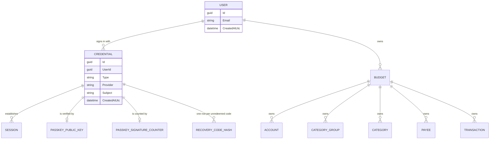
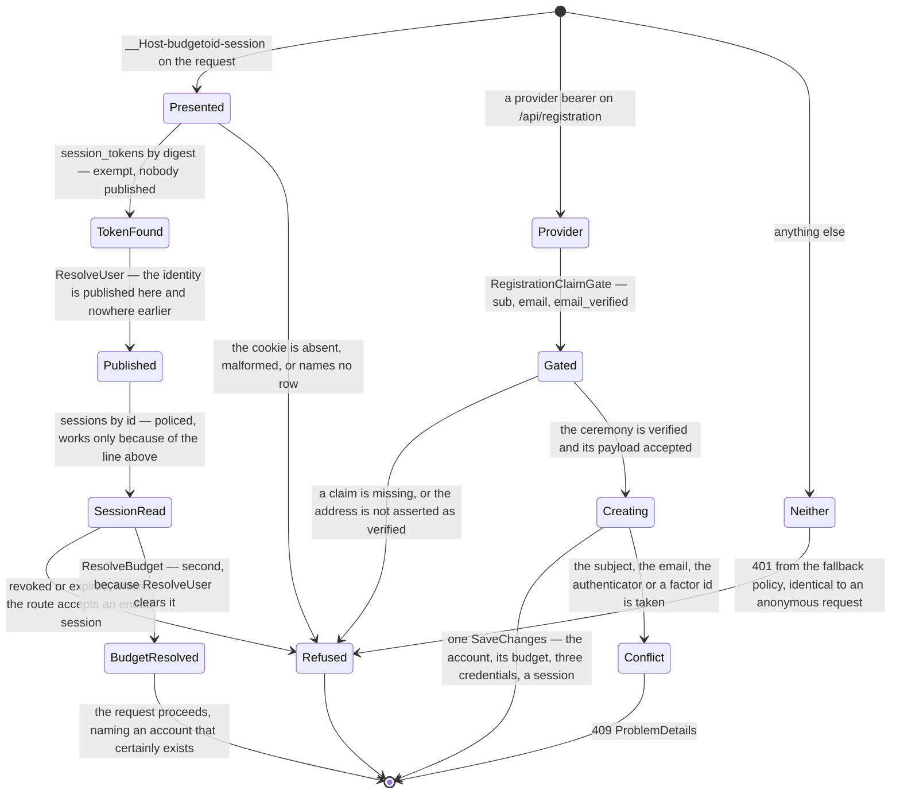

# Users & Ownership

## Table of Contents

- [Purpose](#purpose)
- [Key Entities](#key-entities)
- [Constraints](#constraints)
- [Business Rules & Invariants](#business-rules--invariants)
- [Workflows & State Transitions](#workflows--state-transitions)
- [Decision Trees](#decision-trees)
- [Integration Points](#integration-points)
- [Edge Cases & Known Gotchas](#edge-cases--known-gotchas)

## Purpose

This area covers **who a user is** and how that identity comes to exist. There is **one way in**.
`POST /api/registration` creates an account as one consented act, with its passkey and its card of
recovery codes in the same save — that path has its own file, [registration.md](registration.md), and
the invariant it establishes is now a claim about **every** account in the schema, stated below.
Nothing else writes a `users` row. An authenticated request resolves an account that already exists or
it is refused, and that refusal is **structural rather than a check**: a request authenticates from a
session cookie, a cookie is only ever issued over a session row, and a session row is only ever
written beside the account it names — so "an authenticated request naming an account that does not
exist" is not a state the pipeline can be in. A user owns **Budgets** and nothing
else. Everything else — accounts, category groups, categories, payees, transactions — belongs to a
budget, so **the budget, not the user, is the unit of tenancy.** That invariant and the isolation
rules for the money data live in [budgets.md](budgets.md); this area does not duplicate them. What it
does own is the identity, the two provider claims the one account-creating route reads, the step that
turns a presented session into an internal user together with the ambient budget for the request, and
the isolation of the identity rows themselves — `users`, `budgets`, `sessions` and
`passkey_signature_counters` are the tables scoped to a **user** rather than to a budget, and that
rule has its canonical statement here.

## Key Entities

- **User** — the account owner, identified by a `Guid Id` no external party supplies. It carries no
  identity key of its own: every way of signing in is a **Credential** row instead. It holds an
  `Email` and a creation timestamp, and that is the whole row. Of everything the identity provider
  asserts, only the address is kept — a claim the product does not use is one it does not store,
  because what is never collected never leaks and never has to be erased.
- **Credential** — one way of signing in to an account, carrying exactly one `CredentialType`:
  `Federated` (an external provider vouches for the user), `Passkey` (the authenticator holds it, and
  no external party is involved), or `RecoveryCodes` (one row standing for a whole **set** of codes
  the person wrote down, never one row per code — see [recovery-codes.md](recovery-codes.md)). A
  federated credential names its `Provider` — drawn from a dictionary the database enforces, of
  which `google` is the only member today — and the provider's `Subject`, the OAuth `sub` claim,
  stable, non-empty and at most `Credential.MaxSubjectLength` = 255 characters. The other two carry
  neither. An account may hold more than one credential, but **at most one of type `federated`** and
  **at most one of type `recovery_codes`**. Every account is created with all three at once, in one
  save, by the one route that creates accounts — see the invariant below. A
  signed-in person may then register passkeys beside it, each carrying its own
  verification material on its own tables — see [passkeys.md](passkeys.md) — and may issue
  themselves one set of recovery codes. A signed-in person may **revoke a passkey**, proving
  presence with a fresh WebAuthn assertion, and an account's **last** passkey is refused. The
  **federated** credential is not revocable at all: it is replaced rather than removed, by an
  email change that is not built. A recovery-code set has no revocation route either; it is
  **replaced** by issuing again, which is a single `POST`.
- **`CK_credentials_type_shape` no longer discriminates between `passkey` and `recovery_codes`.**
  Its two arms are byte-identical — both require `provider is null and subject is null` — because both
  are self-contained credentials with no issuer and no issuer-assigned identifier, so from that
  constraint's point of view they are the same shape. What tells them apart lives where it can:
  `CK_credentials_type` bounds the vocabulary, and the child tables' composite foreign keys each
  compare their own `credential_type` copy against `credentials.type`, so a public key cannot hang off
  a set of codes and a code cannot hang off a passkey. **Collapsing the two arms into one would say the
  same thing in less space and lose the record of which types the schema has considered**, so they stay
  written out.
- **Email** — a value object wrapping the email string; required, trimmed, and at most
  `Email.MaxLength` = 254 characters. Two `Email` values are equal iff their strings are equal.
  Uniqueness is a **wider** comparison than that equality: `users.email` carries a unique index on
  the `case_insensitive` collation, so at most one user row holds a given address whatever its
  casing. The address is written once, when the account is registered, and no later request
  changes it — see the rule below about the provider being contacted once.


```mermaid
erDiagram
    USER ||--o{ CREDENTIAL : "signs in with"
    CREDENTIAL ||--o{ SESSION : establishes
    CREDENTIAL ||--o| PASSKEY_PUBLIC_KEY : "is verified by"
    CREDENTIAL ||--o| PASSKEY_SIGNATURE_COUNTER : "is counted by"
    CREDENTIAL ||--o{ RECOVERY_CODE_HASH : "one row per unredeemed code"
    USER ||--o{ BUDGET : owns
    BUDGET ||--o{ ACCOUNT : owns
    BUDGET ||--o{ CATEGORY_GROUP : owns
    BUDGET ||--o{ CATEGORY : owns
    BUDGET ||--o{ PAYEE : owns
    BUDGET ||--o{ TRANSACTION : owns
    USER {
        guid Id
        string Email
        datetime CreatedAtUtc
    }
    CREDENTIAL {
        guid Id
        guid UserId
        string Type
        string Provider
        string Subject
        datetime CreatedAtUtc
    }
```

A **Session** is what a credential establishes once it has answered who is asking. It is its own
area — see [sessions.md](sessions.md) — and this file does not restate its rules.

## Constraints

### MUST

- **Money data is isolated by budget; the identity rows are isolated by user.**
  - **Why**: the MUST/MUST NOT rules for the first — every account, category group, category, payee
    and transaction belonging to exactly one budget, per-budget name uniqueness and ordering, no
    response combining budgets — are documented once, in [budgets.md](budgets.md#constraints). A
    user reaches that data only through the budget they own, so for money "a user can only see their
    own data" is a consequence of budget isolation rather than a separate rule.

    The tables that name a person are the exception, and they carry their own rule: `users`,
    `budgets`, `sessions` and `passkey_signature_counters` are policed by a `user_isolation` policy
    comparing `id` and `user_id` against the session's authenticated user. Budget isolation cannot
    express that — a budget *is* the tenant, so there is no ambient budget to check a budgets row
    against — and leaving it to application code would make the tables that name a person the only
    ones the database does not guard. See
    [ADR 0011](../decisions/0011-police-the-user-owned-tables.md).

    Three tables that name a person are nonetheless **exempt**, and each for the same reason:
    `credentials`, `passkey_public_keys` and `recovery_code_hashes` are read to work out *who is
    asking* and *whether it is really them*, before the request has an identity a policy could be
    keyed on. An exemption is granted to a query but applied to a whole table, so each pins the
    exact column set its reason was argued over, and a new column there goes red until someone moves
    it somewhere policed. See
    [ADR 0012](../decisions/0012-split-a-passkeys-material-by-whether-it-is-read-before-identity.md)
    and [ADR 0016](../decisions/0016-give-recovery-code-hashes-their-own-exempt-table.md). The
    third is the sharpest of them: a recovery code is redeemed by an **anonymous** request, so the
    lookup by hash is what establishes the identity, and a policy keyed on `app.current_user_id`
    would refuse the very query that produces the value it wants to compare against — loudly, with
    `22P02`, on every redemption. `POST /api/recovery-codes/redemption` is the request that makes
    that concrete, and the account it publishes is the one the matched row carries rather than one
    anything asked for.
  - **Enforced in**: the `user_isolation` policies live beside the grants in
    `BudgetoidApp/Infrastructure/Persistence/Provisioning/app-role-grants.sql`, never in a migration;
    `SessionContextInterceptor` puts `app.current_user_id` on every connection the context opens, so
    a session that resolved nobody fails with `22P02` rather than reading another person's row. There
    is no EF query filter above them — the budget lookup that follows a session's own resolve runs
    before the ambient budget exists, so `Budgets` is scoped by owner explicitly in
    `FindFirstForUserAsync`. `credentials`,
    `passkey_public_keys` and `recovery_code_hashes` are the user-owned tables deliberately left
    unpoliced: reading one is *how* a request discovers who is asking and whether it is really them,
    which is also why the credential lookup projects to `credentials.user_id` and never joins `users`.
    `tests/IntegrationTests/RlsIsolationTests.cs` proves the isolation on both axes and
    `RlsCoverageTests.cs` fails any new table that owes a policy and has none.

- **`POST /api/registration` is the only thing in this product that brings an account into
  existence.** No middleware mints one, no marker permits one, and no other route writes a `users`
  row on the way past.
  - **Why**: a Google ID token stays valid for up to an hour after the account it names is erased.
    While account creation was a side effect of being authenticated, one in-flight poll, one second
    tab, or one service-worker retry could resurrect a `users` row carrying the person's email and a
    `credentials` row carrying their Google subject — moments after they asked to be forgotten — and
    that resurrection was unerasable, because the fresh account held no passkey and the
    re-authentication gate in front of erasure refuses it forever. "Leaving the product means actually
    leaving" is the claim [erasure.md](erasure.md) opens with; a single consented creation path is
    what makes it true of every route rather than of the marked ones.
    - **The hole that used to be recorded here is closed, and it is closed structurally.** A route
      group carrying a marker still minted an account from a stale token, and that was written down as
      a gap that would close "when account creation becomes a consented act". This is that. A provider
      token now reaches exactly **two** routes, both under `/api/registration`, and neither completes
      without a live server-minted challenge and a WebAuthn credential the caller's own authenticator
      produced.
  - **Enforced in**: `RegisterAccountHandler`, and by there being no second factory to reach.
    `User.CreateWithId` takes an identifier derived from the ceremony's own challenge and is the
    **only** way to obtain a `User`; the factory that minted its own id is deleted, so a route that
    wanted to create an account would have to add one back — which is the change a reviewer must see.
    The prohibition stopped being a doc comment and became a compile error, and `Domain/Users/User.cs`
    is where it is spelled.
    - **What a provider token now buys, off the route table.** The two registration routes declare a
      policy naming `ProviderAuthentication.SchemeName` and nothing else, so they are the only routes
      `JwtBearer` authenticates at all. Every other route inherits the fallback policy, which names
      the session cookie scheme — `AuthorizationMiddleware` re-authenticates against that handler,
      which answers `NoResult` for a request carrying no cookie, so a bearer presented anywhere else
      is **401 and indistinguishable from an anonymous request**. `RegistrationRouteTests` reads the
      group's scheme off the route table and `AnonymousSurfaceTests` reads the anonymous set whole,
      so neither surface can widen quietly.
  - **Counterexample**: answering the authenticated-but-unresolved case with `204` on the erasure
    route, on the grounds that "no account" satisfies erasure's post-condition. It reads well and it is
    wrong: it creates a path through the erasure handler that reports success having verified nothing,
    which is the one shape that path must never have.
  - **Source**: `[SOURCE: user-story]`

- **A request must resolve to a real internal user and an ambient budget before it can touch data.**
  - **Why**: Handlers stamp and filter by `IBudgetContext.BudgetId`; without a resolved budget there
    is no tenant to scope to, and a default value would silently point at nothing.
  - **Enforced in**: `Application/Sessions/AuthenticateSessionHandler`, on the path **every**
    authenticated request in the product now takes. It publishes both through `IUserContextWriter` and
    never by assigning `CurrentUser` itself — `ResolveUser` then `ResolveBudget`, in that order,
    because `ResolveUser` **clears** any budget resolved for a previous
    identity. `CurrentUserWriter` is the only type that assigns `CurrentUser`, which is what makes
    that clearing rule impossible to skip; nothing but its XML doc enforces the call order, and
    `AuthenticateSessionHandlerTests.HandleAsync_PublishesTheIdentityBeforeTheAmbientBudget` is the
    only thing that pins it. `HttpContextBudgetContext` surfaces the second as
    `IBudgetContext.ResolvedBudgetId`, and the strict `IBudgetContext.BudgetId` derived from it throws
    `"The ambient budget for the current request has not been resolved."` if the budget id is still
    null. The nullable accessor is for the paths that legitimately have none — authentication itself,
    which runs before there is a budget, and infrastructure scopes such as health checks — and neither
    of them touches budget-owned data. `CurrentUser.UserId` exists because the request needs a scoped
    home for the identity the session resolved — no query filters by it.

- **A principal reaching `/api/registration` must carry `sub`, `email` and `email_verified` claims.**
  - **Why**: `sub` is the stable identity the account's federated credential is filed under, and
    `email` is the address the account is reached at — without either there is nothing to create an
    account from. `email_verified` decides whether that address may be registered at all: an address
    the provider will not vouch for is one anybody could have typed, and accepting it would let a token
    claim an address its holder never proved.
    - **Why the rule is now stated about those two routes rather than about every request.** They are
      the only routes a provider token authenticates at all — the group's policy names the provider's
      scheme, and everything else names the session cookie's — so there is no other request on which
      the claims exist to be judged. Nothing was relaxed by narrowing the sentence: what used to run
      on every bearer request now has no other bearer request to run on.
    - **Why here and not in the database**: the rule is about a token, and the database cannot
      inspect one. Pushing it lower would mean procedural logic, which
      [ADR 0002](../decisions/0002-enforce-rules-at-the-lowest-capable-layer.md) rules out. The API
      boundary is the lowest layer capable of enforcing it.
  - **Enforced in**: `Api/Infrastructure/RegistrationClaimGate`, an `IEndpointFilter` declared on the
    `/api/registration` group beside its `RequireAuthorization`, so both legs carry it. It answers
    `401` with `MissingClaimsTitle` when `sub` or `email` is absent or blank, and `401` with
    `UnverifiedEmailTitle` when `email_verified` is absent or is anything `bool.TryParse` does not read
    as `true` — `"false"` and `"1"` alike. **The two titles must stay distinct from each other**, which
    is the property `RegistrationClaimGateTests` holds; a caller cannot act on a distinction the
    response does not make.
    - **Why a filter and not any of the three things that run earlier**, because each is the obvious
      alternative. A `RequireAssertion` on the group's policy and a custom
      `IAuthorizationRequirement` both answer **403 with no title**, collapsing two refusals a caller
      acts on differently into one untitled status. `JwtBearerEvents.OnTokenValidated` can answer 401,
      but writing a titled `ProblemDetails` from there needs `OnChallenge` written too, and the gate
      then becomes a property of the **scheme** rather than of the route — invisible to anybody reading
      the route table, which is where every other rule about who may reach these two routes is
      declared. And a middleware reading a new marker would rebuild the deleted provisioning
      middleware under a different name: the same opt-in metadata, the same silence when a group
      forgets it.
    - **One accepted behaviour change: a `400` can now overtake the `401`.** A filter runs after model
      binding, so a caller sending an unverified address **and** a malformed body is answered `400` by
      the framework where the middleware answered `401`. Nothing in the suite measures the ordering.
      It is a worse order to be told things in, not a disclosure — a deserialization failure is a fact
      about the caller's own request and says nothing about what this server stores. See
      [registration.md](registration.md), which owns the correction this gate's placement is part of.

- **The verified-email claim is read and never stored.**
  - **Why**: it answers one question — may this address be registered — and once answered it holds
    nothing about the person worth keeping. Storing it would be a claim the product carries for no
    reader, which is the thing the account row exists to avoid.
  - **Enforced in**: `RegisterAccountCommand` carries only the subject and the email, so there is no
    field for the answer to land in; the pinned `users` column set leaves it nowhere to go. That
    absence is also **half the reason the claim gate stays at the API boundary** — judging
    `email_verified` in the Application ring would need either a `ClaimsPrincipal` in that project or
    a member here for the answer to land in, and this rule refuses the second by name. See
    [registration.md](registration.md).

- **A user row carries an internal identifier, an email address and a creation timestamp, and no
  other column.**
  - **Why**: what is never collected can never leak, never needs protecting, and never has to be
    erased. Every other claim an identity provider offers — a display name, a picture URL, a locale —
    is read to answer who is asking and then dropped. The rule is worth pinning rather than trusting
    to review because a column arrives one at a time and each one looks harmless on its own.
  - **Enforced in**: `Schema_PinsTheColumnsOfTheUserRow`
    (`tests/IntegrationTests/DataMinimizationSchemaTests.cs`) reads `pg_attribute` and pins the live
    column set; `User_PinsEveryPublicInstanceProperty` (`tests/UnitTests/UserTests.cs`) pins the
    entity's property surface, so a field reappearing in the domain fails before it can reach a
    migration. The schema test reads the catalog rather than the EF model on purpose: a pinned set
    checked against the same code that would have had to notice the column proves nothing.
    - **One candidate column has already been argued and deferred: `default_budget_id`.** PostgreSQL
      cannot express "a user owns at least one budget" without either a trigger — which
      [ADR 0002](../decisions/0002-enforce-rules-at-the-lowest-capable-layer.md) rules out — or a
      circular `users.default_budget_id → budgets(id)`, `NOT NULL DEFERRABLE INITIALLY DEFERRED`,
      checked at commit. That would make "a user with no budget" *unstorable* rather than merely
      unreached, which one save cannot do; see [budgets.md](budgets.md). It is the one column whose
      case is already made, and it is deferred rather than refused, because unlike every claim this
      rule exists to keep out it is a structural pointer rather than a fact about the person. Whoever
      takes it up owns the erasure path — the cascade would then run against a cycle — and owes this
      pin an argument rather than an edit. Read the decision-log entry first; do not treat the
      deferral as permission.

- **A column on any table MUST NOT store an analytics identifier, an advertising identifier, a
  device fingerprint, or a behavioural event record.**
  - **Why**: the account row being minimal is worth little if the same data arrives one table over.
    The product has no reader for any of it, and a column nothing reads is data held for no one — the
    exact shape the minimal account row exists to refuse.
    - **What a first-party security record may still carry**: the session or credential's own
      identifier, when it began, when it expires or was revoked, and when it was last used — each of
      those is read in order to **end** access, and a record that cannot say which session to revoke
      cannot be revoked. What such a record may not do is accumulate one row per sign-in as history,
      or count them. This is why the vocabulary refuses phrases like `session_count` and `last_login`
      rather than the bare words `session` and `login`: a rule that cannot tell a revocable session
      from a measured one would refuse the security feature along with the surveillance. `sessions`
      is the record that shape was argued for, and it carries less than the rule permits — `id`,
      `user_id`, `credential_id`, `kind`, `created_at_utc`, `expires_at_utc`, `revoked_at_utc`, and
      nothing else. See [sessions.md](sessions.md).
    - **Why here and not in the database**: PostgreSQL cannot refuse a column for what its name
      connotes, and reaching it would need an event trigger — procedural logic, which
      [ADR 0002](../decisions/0002-enforce-rules-at-the-lowest-capable-layer.md) rules out. A
      forbidden column can only arrive through a migration, so the build is genuinely the lowest
      capable layer. Unlike the row-level security coverage check, this one is deliberately **not**
      run at deploy time: a policy fails open and can drift from outside the repository, a column
      name cannot.
  - **Enforced in**: `ProhibitedColumnVocabulary`
    (`Infrastructure/Persistence/Provisioning/ProhibitedColumnVocabulary.cs`) is the single spelling
    of the list; `Schema_HoldsNoAnalyticsOrTrackingIdentifier`
    (`tests/IntegrationTests/DataMinimizationSchemaTests.cs`) runs it over **every relation in the
    `public` schema and every column on one**, so a table whose own name says what it holds is
    refused as readily as a column, and a new table is covered without anyone remembering to add it.
    Two probes prove the scan can fail on each axis — `..._ReportsATableThatGrowsSuchAColumn` and
    `..._ReportsATableWhoseOwnNameIsOne` — each deliberately innocent on the axis it is not testing,
    so neither can pass for the wrong reason.
    `Vocabulary_AndTheShippedSchemaShareNoName` reads the same list against every name the EF model
    maps, tables as well as columns, and needs no container. It is symmetric on purpose and its
    failure message says so: a red there is either a pattern wide enough to swallow an ordinary name,
    which narrows — or a genuinely prohibited column somebody just added, in which case the pattern
    is right and it is the **schema** that changes. Reading it only the first way is how a real
    tracking column gets made green by weakening the rule that caught it.
    - **Each pattern is matched in the plural as well as as written.** The matcher compares whole
      tokens and does not stem, so `device_fingerprints`, `page_views` and `event_logs` walked past a
      list that refused their singulars — and every table in this schema is named in the plural. The
      plural comes from `IdentifierTokens.PluralOf`, shared with the erasure-remnant vocabulary so
      the two cannot disagree about what a plural is.
    - **A name can carry two patterns, and then the order of `Rules` decides.** No pattern's tokens
      sit inside another's, so no rule shadows another — but `analytics_event_log` reaches
      `analytics` and `event_log`, which are in different categories, and the first rule listed wins.
      A new pattern overlapping an existing one has to say in its reason which category it means to
      win.

- **An email address belongs to at most one user, compared case-insensitively.**
  - **Why**: Two rows holding the same address are two people as far as every budget is concerned,
    and the address is the only human-readable thing that identifies a user — a support request, an
    export or a future notification has nothing else to go on. Case is not part of the address for
    this purpose: `Sam@example.com` and `sam@example.com` reaching the same mailbox but occupying two
    rows would be the same ambiguity with an extra step.
  - **Enforced in**: `UserConfiguration` maps `email` to `varchar(254)` on the `case_insensitive`
    collation with the unique index `IX_users_email`, so PostgreSQL refuses the second row whatever
    code path wrote it. `Email.Create` restates the length bound for message quality only, reading
    the same `Email.MaxLength` constant the column is generated from.

### MUST NOT

- **A request MUST NOT reach data outside its ambient budget.**
  - **Why**: stated in [budgets.md](budgets.md#must-not), which owns the tenancy rules — this file
    does not restate them.
  - **Enforced in**: another budget's row is unreachable under the `budget_isolation` row-level
    security policies, resolves to `null` through the `BudgetIsolation` filter above them, and
    surfaces as a 404 when it was the target of the request or a 400 when it was a reference inside
    one, never a 403.

## Business Rules & Invariants

- **Rule**: An account holds **exactly one** `federated` credential, **at least one** `passkey`, and
  **exactly one** `recovery_codes` set, from the instant it exists. This is a claim about **every**
  account in the schema, not about one write path's output.
- **Why**: those three credentials are what make an account reachable, readable and recoverable, and
  an account missing any of them is broken in a way no later request repairs. A `federated` credential
  alone opens a session that reaches no budget content at all, so the account exists holding nothing
  that can ever read it — and because erasure is gated on a fresh WebAuthn assertion, it cannot even
  be emptied. A passkey with no card is an account whose keys leave with the device.
  - **Why the database does not hold it, which is the statement
    [ADR 0002](../decisions/0002-enforce-rules-at-the-lowest-capable-layer.md) requires.** All three
    are **cross-row** claims: no `CHECK` sees a sibling row, and no unique index expresses "at least
    one". The two mechanisms that could reach them are both refused. A **trigger** is procedural logic
    pushed down purely to satisfy "lowest layer", which ADR 0002 rules out. A **circular deferred
    foreign key** — `users` pointing back at the credential that reaches it, `NOT NULL DEFERRABLE
    INITIALLY DEFERRED` — would make the state unstorable, at the cost of a cycle in the owned graph
    that the erasure cascade would then have to run against. The schema holds only the two *upper*
    bounds, and those it holds properly: `IX_credentials_user_id_federated` and
    `IX_credentials_user_id_recovery_codes`, each partial on its own `type`.
  - **What holds it instead is that exactly one write path creates a `users` row and writes all three
    credentials in the same save**, and three things now make that a fact rather than a claim about
    today's call sites. `RegisterAccountHandler` is the only code that brings an account into
    existence. It is reachable from `/api/registration` and from nowhere else. And **`User.Create` —
    the factory that let a caller mint an account under a fresh identifier — is deleted**, leaving
    `User.CreateWithId`, which takes an id derived from the ceremony's own challenge and refuses
    `Guid.Empty`. So a second creating path cannot be written by calling something that already
    exists: it has to add a factory to `Domain/Users/User.cs` first, which is the change a reviewer
    must see. The prohibition stopped being a doc comment and became a compile error.
  - **The schema still permits the state; nothing in the product produces it.** The three claims are
    cross-row, so no constraint refuses a credential-less `users` row and a direct `INSERT` still
    writes one. What changed is that no code path can: the only factory is reached from one handler,
    and a test or seeding helper that wanted a bare account would have to restore the deleted factory
    to get one. Do not restore it to make a fixture shorter.
- **Enforced in**: `RegisterAccountHandler` builds all five entities and hands them to
  `IRegistrationRepository.RegisterAsync`, which adds and saves **once**; `Domain.Users.Registration`
  is the record that makes "a registration without one of them" unspellable, since every member is
  required and every member is an entity rather than the raw material it was built from. Above that,
  the ladder refuses a request carrying no card or no wrapped keys before anything is written. See
  [registration.md](registration.md).
- **Counterexample**: adding a second route that creates an account — a support tool, a seed path, an
  import. Every test in the suite stays green and the account it produces can never read itself. The
  deleted factory is what makes that cost a visible edit rather than a call.
- **Source**: `[SOURCE: user-story]`

---

- **Rule**: The identity provider is contacted **once in an account's life**, at registration. What it
  reports afterwards changes nothing about the stored account, and nothing in the product asks it
  again.
- **Why**: it vouched for this person once, and that is not standing authority to rewrite what the
  account holds — an address the user never asked to change is not an address they can be reached at,
  and silently adopting one would move the account's only human-readable identifier because a token
  said so. Signing in afterwards is a passkey assertion or a redeemed recovery code, neither of which
  involves any third party, so there is no later moment at which the provider has anything to say.
  - **Consequence, accepted**: the stored address goes stale, and there is no way to update it yet.
    Changing it is its own operation, requiring its own fresh authorization exchange, and that is
    not built.
  - **The federated credential is still the account's link to that one exchange**, filed under
    `(provider, subject)` and unique across the table, which is what makes a second registration from
    the same Google identity a `409` rather than a second account. It is read on exactly one path
    after creation — `RegisterAccountHandler` re-reads it to settle an ambiguous email collision —
    and by nothing else.
- **Enforced in**: nothing writes `users.email` after the insert. The `UPDATE` grant on `users` names
  `email` alone and **has no caller at all**; the domain exposes no mutator; and
  `RegisterAccountCommand` is the only command that carries an address. The default budget is written
  **in the same save** as the user and its credentials, so "an account exists ⇒ it owns a budget"
  needs no repair step, and the read that follows a session's resolve throws if it is absent. That
  half is documented in [budgets.md](budgets.md#business-rules--invariants) and not restated here.
- **Example**: a person registered as `old@example.com` changes their Google address to
  `new@example.com` and signs in with their passkey. Nothing in that exchange reaches Google, and the
  account is still reachable at `old@example.com`.
- **Counterexample**: keying identity on `email` instead of the credential. It would break the moment
  somebody changed their Google address — the same human would arrive as a stranger — which is also
  why the address is not refreshed: the credential is the identity, so a changed address is new
  *information about* the account, not a new account and not a fact the account must adopt.
- **Source**: `[SOURCE: discussion]`

---

- **Rule**: The signed-in account's own email address is readable at `GET /api/me`, by that account
  and by nobody else. Nothing else about the account is returned.
- **Why**: a settings surface has to show the address the account can actually be reached at, and
  that is the **stored** one — deliberately never refreshed from the provider by the rule above. A
  client that decoded the ID token instead would show whatever Google asserts today, which is a
  different value the moment the person changes their Google address, and the account would still be
  reachable only at the old one. So the disagreement between the two is not a defect this endpoint
  papers over; it is the reason the endpoint exists rather than the claim being read client-side.
  - **Only the email, because only the email is displayed.** An internal user id handed to a client
    is an identifier the client will eventually send back, and every tenancy value in this API is
    resolved server-side from the authenticated subject and never addressed by the caller — the rule
    `BudgetRouteConstructionTests` holds the route table to, and the one `ExportDataQuery` and
    `EraseAccountCommand` state for their own inputs. Publishing one for a field nothing renders is
    the first half of a client-supplied tenancy parameter. Widening the response later is additive
    and cheap; narrowing it is breaking, which is why the narrow shape is the one that ships.
  - **Handing back null is a race, not a 404.** No *stored* state produces it: the account, its
    three credentials and its default budget land in one `SaveChanges`, and `credentials` cascades
    from `users` on delete, so a live session standing over a missing user row is not a shape the
    schema holds. What produces one is **read skew** — authentication reads `session_tokens`, then
    `sessions`, then `budgets`, and only then does the handler read `users`, four round
    trips sharing no transaction, so an erasure committing inside that window leaves the earlier
    reads valid and this one empty. The handler throws and the caller sees the 500
    `GlobalExceptionHandler` writes, which is also how the budget read answers the same race one
    step earlier. Answering "no such account" to a request the pipeline has just authenticated *as
    that account* would file it as an ordinary missing resource, which is the one shape nobody
    investigates.
  - **The address change is not here.** `GET /api/me` is a read; nothing in the product writes
    `users.email` after the insert, and the gap below still stands.
- **Enforced in**: `GetSignedInUserHandler` reads `IUserContext.UserId` and never an id from the
  request — `GetSignedInUserQuery` carries no member and may not gain one. It projects the single
  column through the existing `IUserAccountReadService.FindEmailAsync`; `user_isolation` on `users`
  is what makes another account's id answer nothing rather than answer theirs, so the id predicate is
  an index seek rather than the thing doing the scoping. The route declares no authorization metadata
  of its own, which is now what *gates* it rather than what leaves it open: the application's fallback
  policy names the session cookie scheme, authenticates the request against that handler alone, and
  refuses a session that reads no budget content — so a federated sign-in is answered `403` here, and
  a provider bearer outliving an erasure is answered the same `401` an anonymous request gets, because
  the cookie handler returns `NoResult` for a request carrying no cookie. **Nothing can mint an
  account here because nothing anywhere but `/api/registration` can.**
  `SignedInUserEndpointTests` carries the pair that
  makes the read meaningful — a second account established *after* the first, each asking for itself,
  asserted in both directions, because with one account every wrong answer and the right one are the
  same value.
- **Example**: a person registered as `old@example.com` changes their Google address to
  `new@example.com` and signs in again. The token now asserts `new@example.com`; `GET /api/me`
  answers `{"email":"old@example.com"}`, because that is the address the account is reachable at
  until an email change is built. `SignedInUserEndpointTests.`
  `Me_ForASubjectWhoseProviderAddressChanged_RespondsWithTheStoredAddress` drives exactly that
  sequence — two clients on one subject carrying different claims — and asserts both that the stored
  address is returned and that the claim's address appears nowhere in the body. Without the second
  half, an endpoint echoing the claim passes: in every other test the claim and the stored row hold
  the same string, so nothing there could tell them apart.
- **Counterexample**: a response carrying `id` or `createdAtUtc` is exactly the widening this rule
  refuses. `SignedInUserEndpointTests.Me_ResponseCarriesTheEmailAndNothingElse` enumerates the
  arriving members and joins them, so it reports `"createdAtUtc, email"` rather than that a count
  moved — the member to delete is named in the failure. It is a pin, green the day it was written,
  and it was watched fail against a deliberately widened record before it was trusted.
- **Source**: `[SOURCE: user-story]`

---

- **Rule**: A credential's **identity columns** — `user_id`, `type`, `provider`, `subject`,
  `created_at_utc` — are immutable. On `users`, `Email` is the only column that can change.
- **Why**: The credential is the identity anchor — repointing its subject would silently hand an
  account to a different principal, and changing its `user_id` would move a sign-in between
  accounts. That identity is written whole at registration and has no edit that means anything. The
  address is the one column on `users` an edit could ever legitimately touch — the grant is what an
  edit *may* reach, and today no code path reaches it at all.
  - **Scope, stated precisely because the obvious reading is wrong**: the identity columns *are*
    every column of `credentials`, so the table holds no `UPDATE` grant of any shape. Read that as a
    property of the table rather than as the current state of a list. A passkey's mutable fact — the
    signature counter its authenticator reports — lives on `passkey_signature_counters`, which
    carries `user_id` and is policed, because it is compared only *after* an assertion's signature
    verifies, while `credentials` is exempt from row-level security precisely because it is read
    *before* that. The rule being defended is "a credential's identity is never rewritten" rather
    than "a credential is never written", and the boundary that keeps the two apart is a table
    rather than a column list. See
    [ADR 0012](../decisions/0012-split-a-passkeys-material-by-whether-it-is-read-before-identity.md).
- **Enforced in**: **database-owned, restated in the domain.** The application role has no `UPDATE`
  grant on `credentials` of any shape — not a column list with nothing on it, but no grant at all —
  so every `UPDATE` is refused with `42501` on the connection every request is served by. The role
  *does* hold `INSERT` and, since revocation, `DELETE`. **Removing a whole row is not an edit of an
  identity**, so the `DELETE` leaves this rule untouched: no statement the role can run rewrites
  which principal a credential names. What bounds the `DELETE` is the revocation rule below, and it
  is bounded by the application alone. On `users` the `UPDATE` grant names `email` alone, leaving
  `created_at_utc` immutable by *omission* rather than by a `REVOKE`, which additive column
  privileges could not express. A one-column list is still a list, and must not be "simplified"
  into a table-wide grant; see
  [ADR 0004](../decisions/0004-connect-as-a-least-privilege-role.md).
  `AppRoleGrantsTests.`
  `Database_RefusesEveryUpdateOnACredentialsIdentity_WhileStillAllowingInsertAndDelete`
  pins the refusals column for column against a permitted insert and a permitted delete, and
  `Database_RefusesToChangeAUsersCreatedAt_WhileStillAllowingProfileEdits` pins that the users grant
  really is a list. Above them, neither `Domain/Users/User.cs` nor `Domain/Users/Credential.cs`
  exposes a mutator: both are written whole and never edited.
  - **Gap, stated rather than hidden**: the `users` `UPDATE` grant now has no caller. It is a
    privilege the role holds and nothing exercises, which is the opposite of how the rest of this
    matrix is built. It stays because the gated email change and the erasure scheduling that need it
    are both specified and both next; if either slips, the grant should be revoked rather than left
    standing.
- **Example**: nothing in the application can change a stored email, so the 409 on the insert path
  is the only outcome a duplicate address can produce.
- **Source**: `[SOURCE: discussion]`

---

- **Rule**: A signed-in person may **list every credential** the account holds, and **revoke a
  passkey** — but the account must keep at least one passkey, and the federated credential is out of
  revocation's reach entirely. `GET /api/me/credentials` and
  `POST /api/me/credentials/{credentialId}/revocation`; the revocation carries a fresh WebAuthn
  assertion in its body, exactly as erasure does.
- **Why**: an authenticator that is lost, sold, or compromised has to be removable without erasing
  the account, which was the only remedy before. The floor of one passkey exists because `federated`
  is the one credential type that can never open a session reaching budget content: an account left
  holding only its federated credential could still sign in, still could not reach its own money, and
  could not even prove presence for an erasure.
  - **The floor is "the last passkey" and a set of recovery codes does not lift it**, which is the
    reading a later story will be tempted into. A recovery-codes credential derives a `Full` session,
    so it looks like the second thing that should satisfy the floor. It cannot, and the reason is
    circular by construction: **issuing a set requires a fresh passkey assertion**, so an account
    holding codes and no passkey can never regenerate them, and once those codes are spent or lost
    there is nothing left to re-authenticate with. Allowing the last passkey to be revoked because
    codes exist would trade a state a person can recover from for one nobody can. The floor moves
    only when some path can issue a recovery factor without already holding one. See
    [recovery-codes.md](recovery-codes.md).
- **Enforced in**: `RevokePasskeyHandler`, and **nowhere below it.** The rule is a cross-row claim —
  no `CHECK` sees another row, no unique index expresses "at least one" — and both mechanisms that
  could reach it are refused: a trigger by
  [ADR 0002](../decisions/0002-enforce-rules-at-the-lowest-capable-layer.md), a materialized counter
  column by the pinned exemption column set. ADR 0002 requires the owning doc to say *why* whenever a
  rule sits above its lowest capable layer, and this paragraph is that statement. The refusal answers
  **409**: the request is well-formed and would succeed the moment a second passkey exists.
  - **How the target is scoped, and why a delete by primary key is sound**: the credential is loaded
    through `FindPasskeyCredentialAsync(credentialId, userId)` — id, owner and type in one
    predicate — and the loaded **entity** is handed to the delete, never an id. `credentials` is
    exempt from row-level security, so that read is the only thing scoping the statement. What makes
    it sufficient is the rule immediately above: `credentials.user_id` is immutable, so the binding
    between an id and its owner cannot move between the read and the write. See
    [ADR 0014](../decisions/0014-scope-the-credential-delete-in-the-application.md).
  - **The federated credential is refused by construction rather than by a branch**: the `type`
    predicate sits inside the same lookup, so revoking it answers the same **404** an unknown id
    answers. A branch on `Type` would produce a better client message and is exactly the kind of
    comparison a later refactor deletes.
  - **Known gap**: the count and the delete are not serialized against each other, so two concurrent
    revocations can leave an account with zero passkeys — see [passkeys.md](passkeys.md).
- **Counterexample**: counting the account's passkeys through the list projection instead of the
  repository. A rule keyed on a value chosen for display is what the read-service/repository split
  exists to prevent.
- **Source**: `[SOURCE: user-story]`

---

- **Rule**: The application role may **delete a `users` row**, and that one statement removes the
  account's whole structural graph. Of the other **user-owned** tables it holds `DELETE` on exactly
  two, `credentials` and `recovery_code_hashes`, and **neither grant exists for erasure** — the
  first is for passkey revocation, the second for redeeming a recovery code. `budgets`, `sessions`,
  `passkey_public_keys`, `passkey_signature_counters` (user-owned) and `payees` (budget-owned) are
  emptied by the cascade descending from the `users` row, not by a privilege of their own, and so
  is `recovery_code_hashes` — its own grant is beside the point for this path. The asymmetry is
  worth reading twice: erasure needs neither of those two grants and would still work if both were
  revoked tomorrow.
- **Why**: erasing an account has to run as the application rather than on an elevated connection —
  that is the whole point of [ADR 0004](../decisions/0004-connect-as-a-least-privilege-role.md), and
  a role that needed a database administrator to delete a row would dissolve it. Every owned table
  hangs off `users` by `ON DELETE CASCADE`: `users` → `budgets` → {`payees`, `accounts`,
  `category_groups` → `categories`}, and `users` → `credentials` → {`sessions`,
  `passkey_public_keys`, `passkey_signature_counters`}. PostgreSQL performs a referential action
  through internal triggers running with the privileges of the **referencing table's owner**, not of
  the role that issued the statement, so the cascade reaches every one of those tables with no grant
  on any of them.
  - **It is not sufficient on its own.** Five edges in the owned graph are `Restrict` rather than
    `Cascade`, and erasure empties the one table that is the child of four of them — `transactions` —
    before it deletes this row; see [erasure.md](erasure.md), which owns the sequence and the reasons
    for it. The whole sequence runs on **one** session: `SessionContextInterceptor` writes
    `app.current_user_id` and `app.current_budget_id` in the same statement on every connection
    open, so the connection serving an authenticated request already names both the user
    `user_isolation` reads and the budget `budget_isolation` reads.
  - **The grants the cascade does without are a decision, not an oversight.** `budgets`, `payees`,
    `sessions`, `passkey_public_keys` and `passkey_signature_counters` hold no `DELETE` of any
    shape, and two of those absences would cost something real to fill. `passkey_public_keys` is
    exempt from row-level security — it is read *before* a request has an identity a policy could
    key on — so a `DELETE` there would be **unpoliced**, and one statement carrying the wrong id
    would remove somebody else's only way in with nothing to catch it; that is the hazard
    `credentials`' own `DELETE` already carries, bounded by the application and by nothing beneath
    it. On `passkey_signature_counters` a `DELETE` would reopen counter rewind: deleting the row and
    re-inserting it at zero is the same thing the deliberately single-column
    `GRANT UPDATE (signature_counter)` exists to forbid. The cascade reaches every one of them
    safely, because it descends from one row rather than holding a privilege over a table.
- **Enforced in**: **database-owned.** `GRANT SELECT, INSERT, DELETE ON users` in
  `app-role-grants.sql`, scoped by the `user_isolation` policy — which is `FOR ALL`, so it constrains
  the delete exactly as it constrains a read.
  `AppRoleGrantsTests.Database_AllowsDeletingAUserAndCascadesTheAccountAway` is what turns the
  cascade from a belief into a fact: it deletes as the application role and asserts every child table
  is empty afterwards. `RlsIsolationTests.Database_RefusesToDeleteAnotherUsersRow_WhileStillAllowingItsOwn`
  pins that the grant is tenant-scoped — a foreign row reports **zero rows affected**, not `42501`,
  which is the policy holding rather than the grant matrix.
  `AppRoleGrantMatrixTests.AppRoleGrants_MatchTheDeclaredMatrix` pins the whole privilege set in both
  directions, so a `DELETE` added to a seventh table fails as loudly as one removed from this one.
  - **Its caller is the erasure endpoint.** `POST /api/me/erasure` reaches this grant through
    `EraseAccountHandler` and `IUserRepository.DeleteAsync`, and the id it deletes is read from
    `IUserContext` rather than from the route or the body. `EraseAccountCommand` carries the
    re-authentication assertion and **no field naming an account** — its members name a credential
    handle, which the owner-scoped lookup makes incapable of selecting one. The rule is "no account
    may be named", not "no members". See [erasure.md](erasure.md).
- **Source**: `[SOURCE: user-story]`

---

- **Rule**: An email must be present (non-blank, trimmed) and at most 254 characters. Format is
  **not** validated. A credential's `Subject` is bounded at 255 characters and its `Provider` at 50.
- **Why**: The email comes from a trusted Google ID token, which has already verified it — a regex
  check would add friction without adding trust. Presence is still required because it is the one
  channel by which the product can reach its user. The bounds are what the values are: 254 is the
  practical RFC 5321 address limit (the 256-octet path less the enclosing angle brackets) and 255 is
  Google's documented cap for the `sub` claim. The domain restatement exists so an over-long value
  is a 400 with a sentence, rather than a raw `22001` from the column surfacing to the caller as
  a 500.
- **Enforced in**: the `varchar(254)` column declared in `UserConfiguration`, `varchar(255)` and
  `varchar(50)` in `CredentialConfiguration`; the domain restates each bound in `Email.Create` and
  `Credential.CreateFederated` so the caller gets a 400 with a sentence instead of a database error.
  The two expressions of each bound cannot drift, because each configuration reads `Email.MaxLength`,
  `Credential.MaxSubjectLength` and `Credential.MaxProviderLength` rather than repeating the numbers.
  `Provider`'s 50 is now only the column width: the dictionary below rejects every value the length
  bound would have, so no branch in the domain tests it separately.
- **Example**: a 300-character `email` claim is rejected by `Email.Create` with "Email must be 254
  characters or fewer." rather than being silently cut to fit.
- **Counterexample**: assuming the column *truncates* to fit. It does not — `varchar(n)` **rejects**
  an over-long value with SQLSTATE `22001`, which is what makes it enforcement in the sense
  [ADR 0002](../decisions/0002-enforce-rules-at-the-lowest-capable-layer.md) means. Contrast
  `numeric(14,4)` on the money columns, which silently rounds an over-precise value and therefore
  enforces nothing, leaving the decimal-places rule domain-owned while separate check constraints
  carry the magnitude half. These three columns are the cleanest illustration in the schema of the
  difference.
- **Source**: `[SOURCE: discussion]`

---

- **Rule**: A federated credential's `Provider` must be a member of a **dictionary**, and its
  `Subject` must be non-empty.
- **Why**: `"Google"` and `"google"` are the same provider to a person and two identities to a
  unique index, so one human ends up with two accounts and neither can see the other's budget. The
  `Subject` half closes a phantom identity: `('federated', 'google', '')` used to be a legal row
  occupying a slot in the unique index, refused only by the domain — and the tests reach this table
  with raw SQL. Note what the fix is **not**: `Credential.CreateFederated` *rejects* a non-canonical
  spelling rather than lowercasing it. Coercing would make acceptable a value the column is about to
  refuse, which [ADR 0002](../decisions/0002-enforce-rules-at-the-lowest-capable-layer.md) rules
  out, and it would be a live bug besides — `FindUserIdByFederatedCredentialAsync` trims but does
  not fold case, so a coerced write would store a row its own lookup could never find.
- **Enforced in**: `CK_credentials_provider` (`provider is null or provider in ('google')`) and the
  `length(subject) > 0` term added to the federated arm of `CK_credentials_type_shape`; restated in
  `Credential.CreateFederated` for message quality. The two live in separate constraints on purpose:
  one defect must report one name, because `RepositoryConstraintAttributionTests` pins attribution by
  constraint name. `subject is not null` stays alongside `length(subject) > 0` and is **not**
  redundant — `length(null)` is `null`, and a CHECK evaluating to `null` is satisfied, so dropping
  the null test would silently readmit a null subject.
- **Counterexample**: adding `length(provider) > 0` "for symmetry". The dictionary already refuses an
  empty provider, and two constraints refusing the same row make the reported name nondeterministic.
- **Source**: `[SOURCE: discussion]`

---

- **Rule**: An account holds **at most one** credential of type `federated`.
- **Why**: it is what makes "which provider gates this account" a question with one answer. Nothing
  is being built that would add a second, which is the point — this guards against a **bug** on the
  credential-insert paths, and more of those are coming.
- **Enforced in**: the partial unique index `IX_credentials_user_id_federated` on `(user_id) WHERE
  type = 'federated'`, pinned as `CredentialConfiguration.FederatedPerUserIndexName`. It is a
  *different* rule from `IX_credentials_provider_subject`, which says one account per provider
  identity: that one catches two users claiming one Google identity, this one catches one user
  holding two. Both tests exist and neither is a duplicate of the other.
  - **Gotcha on the index declaration**: declaring this index made EF's `ForeignKeyIndexConvention`
    stop generating the plain `IX_credentials_user_id`, because the convention backs off as soon as
    *any* index covers the column — uniqueness and filter irrelevant. It is therefore declared
    explicitly now. Removing that declaration would silently leave cascade delete and every read of
    an account's credentials with only a federated-rows-only index.
  - **The same rule shape now exists over the other self-contained type.**
    `IX_credentials_user_id_recovery_codes`, partial on `type = 'recovery_codes'`, gives an account
    at most **one issued set of recovery codes**. Nothing else on the row refuses a second — the
    provider-identity index names federated rows only, and every recovery-codes row carries
    `(NULL, NULL)`. Two sets are two remaining-counts with nothing saying which one binds. The
    filter is load-bearing rather than tidy: an **unfiltered** unique index over `user_id` enforces
    this rule just as well and also refuses an account a second passkey, which is expressly allowed.
    Its `23505` is translated into a `409` naming a lost race; see
    [recovery-codes.md](recovery-codes.md).
- **Source**: `[SOURCE: discussion]`

---

- **Rule**: An email address may be held by only one user. A collision on the insert path is a
  **409**. There is no other path on which one can occur.
- **Why**: Identity is the credential row; `email` is what the provider asserted when the account
  was created. A collision that is not a lost race leaves nothing to adopt — no credential carries
  this subject, so the person behind it is new, and failing closed with a legible 409 is the honest
  answer. Nothing updates `users.email` after the insert, so a returning user cannot collide with
  anyone: the only write that could breach the index is the one that creates the account.
- **Enforced in**: three layers, deliberately. The unique index `IX_users_email` on the
  `case_insensitive` collation is what makes the rule *true*. `RegistrationRepository` reports the
  rejection without interpreting it: `RegisterAsync` writes the whole account in one save and answers
  `EmailTaken` for a unique violation of the email index and `SubjectTaken` for one of the
  credential's `(provider, subject)` index, because a losing insert can breach both at once and the
  database names only one. One save is also what keeps a refused insert from leaving a user row
  behind: an orphan would hold its unique email while no credential resolved to it, and every later
  attempt with that address would 409 with no way to heal. `RegisterAccountHandler.RefusalFor` is
  where the treatment is chosen — on `EmailTaken` it re-reads by `(provider, subject)` and, finding a
  credential there, answers the *subject* sentence instead, because the email index being named says
  nothing about the subject. Otherwise it throws `ConflictException` ("This email address is already
  linked to a different Google account."), which `ConflictExceptionHandler` renders as 409
  ProblemDetails. **Whether a collision is one rule or two is application
  policy, sitting above the database on purpose**: the database rejects the write and cannot even
  say which of the two rules it rejected it for, so only the application can separate them.
  - **The race winner is never adopted, and that is where this path diverges from what the deleted
    provisioning path did.** Adopting would sign the caller into an account **their brand-new passkey
    cannot open** — the winning account holds the winner's factors, not theirs. So a lost race and a
    stranger holding the address answer the same way: nothing was created, sign in instead. See
    [registration.md](registration.md).
- **Example**: a person whose Google account was recreated registers with a new `sub` and their old
  address. Registration refuses with 409 and a sentence naming the cause, rather than quietly
  handing them an empty second budget.
- **Counterexample**: deciding the outcome from the reported constraint name alone — email index
  means "a stranger holds it", subject index means "already registered" — is right in one direction
  and unsound in the other. EF writes `users` before `credentials`, so an insert that duplicates both
  reports the **email** index, and that person would be told their own address belongs to a different
  Google account. Only the re-read separates the two.
- **Source**: `[SOURCE: discussion]`

## Workflows & State Transitions

**How a request comes to name an account.** There are two shapes and they share no code: a request
*presenting a session* resolves one, and a request *under `/api/registration`* creates one. Nothing
else in the product does either.


```mermaid
stateDiagram-v2
    [*] --> Presented : __Host-budgetoid-session on the request
    [*] --> Provider : a provider bearer on /api/registration
    [*] --> Neither : anything else

    Presented --> TokenFound : session_tokens by digest — exempt, nobody published
    Presented --> Refused : the cookie is absent, malformed, or names no row
    TokenFound --> Published : ResolveUser — the identity is published here and nowhere earlier
    Published --> SessionRead : sessions by id — policed, works only because of the line above
    SessionRead --> Refused : revoked or expired, unless the route accepts an ended session
    SessionRead --> BudgetResolved : ResolveBudget — second, because ResolveUser clears it
    BudgetResolved --> [*] : the request proceeds, naming an account that certainly exists

    Provider --> Gated : RegistrationClaimGate — sub, email, email_verified
    Gated --> Refused : a claim is missing, or the address is not asserted as verified
    Gated --> Creating : the ceremony is verified and its payload accepted
    Creating --> [*] : one SaveChanges — the account, its budget, three credentials, a session
    Creating --> Conflict : the subject, the email, the authenticator or a factor id is taken

    Neither --> Refused : 401 from the fallback policy, identical to an anonymous request
    Refused --> [*]
    Conflict --> [*] : 409 ProblemDetails
```

| Transition | Triggered by | Validations |
|---|---|---|
| Presented → TokenFound | The cookie decodes to 32 bytes whose `SHA-256` names a `session_tokens` row | The lookup runs on an **exempt** table naming nobody, because the value it produces is the value a policy on `sessions` would need. See [sessions.md](sessions.md) |
| TokenFound → Published → SessionRead | Always, and **in that order** | Reversed, the policed read meets `''::uuid` and every request in the product answers `22P02`. No transaction may wrap any of it |
| SessionRead → Refused | The session is revoked or past its expiry | 401, except on the one route carrying `AcceptsEndedSessionAttribute`, which reaches no ambient budget even there |
| SessionRead → BudgetResolved | A live session | The account's first budget; `ResolveBudget` runs after `ResolveUser` because that call clears it |
| Neither → Refused | An authenticated bearer on any route outside `/api/registration`, or nothing at all | **The same 401.** The fallback policy names the session cookie scheme, so `AuthorizationMiddleware` re-authenticates against that handler alone and it answers `NoResult` for a request with no cookie. A provider token outliving an erasure is therefore indistinguishable from an anonymous request, and writes nothing because nothing outside registration writes a `users` row |
| Provider → Gated | Either leg of `/api/registration` | The group's policy names `ProviderAuthentication.SchemeName` and nothing else, so this is the only place a bearer authenticates. `RegistrationClaimGate` then requires `sub`, `email` and `email_verified`, with a distinct title for each of the two refusals |
| Gated → Creating | A verified account-registration ceremony, a `prf` result, a canonical factor id, two envelopes and ten submissions | `User.CreateWithId` validates the derived identifier and the address; `Credential.CreateFederated` validates provider and subject; `Budget.CreateDefault` validates the owner. See [registration.md](registration.md) |
| Creating → Conflict | A unique violation on one of four pinned index names | `RegisterAsync` reports which, `RefusalFor` chooses the sentence, and **the race winner is never adopted** — the caller's brand-new passkey could not open that account |

## Decision Trees

How a request comes to name an account, or fails to:

```
IF the request presents __Host-budgetoid-session
  read session_tokens by the digest                      ← exempt table, no identity on the connection
  IF no row matches
    THEN 401                                             ← the cookie names nothing
  ELSE
    publish the account the row carries                  ← before the policed read, never after
    read the sessions row
    IF it is revoked or expired
      THEN 401, unless the route accepts an ended session
    ELSE
      publish the account's first budget and continue    ← the account certainly exists: the cookie
                                                           was issued over a session row written
                                                           beside it
ELSE IF the route is under /api/registration             ← the only routes JwtBearer authenticates
  IF sub or email is missing or blank
    THEN 401 ProblemDetails "Authenticated principal is missing required claims."
  ELSE IF email_verified does not parse as true              ← absent, blank, "false" and "1" all fail
    THEN 401 ProblemDetails "Authenticated principal's email address is not asserted as verified."
  ELSE
    run the ceremony ladder, derive the account id, publish it, save once
                                                         ← registration.md owns every rung
ELSE
  THEN 401 from the fallback policy                      ← a bearer here authenticates nothing at all:
                                                           the policy names the cookie scheme and its
                                                           handler answers NoResult
```

Every repository catch that handles a PostgreSQL error filters on `PostgresException.ConstraintName`
as well as on the SQLSTATE, against a name pinned as a constant on the owning configuration — the
practice lives in [ADR 0002](../decisions/0002-enforce-rules-at-the-lowest-capable-layer.md), under
"A violation report names one rule, not every rule that was violated". Here that is why
`RegistrationRepository`'s catches filter on four pinned index names, two of which are
`IX_users_email` on `UserConfiguration` and `IX_credentials_provider_subject` on
`CredentialConfiguration` — declared as constants instead of left to EF's naming
convention. What that filter decides is whether a `23505` is a failure this path models at all: a
property rename that shifted a generated index name would leave the catch unmatched and turn an
actionable 409 into an opaque 500, and the
unmatched `23505` nobody modelled falls through on purpose, because a 500 naming an unknown
constraint is more useful than a false "someone else won the race". What a constraint name cannot
decide is *what went wrong*. It identifies the rule the database reported, not the set of rules the
row violated — an insert that duplicates a credential's subject duplicates that user's email along
with it, and the user row is written first, so the email index is the one that reports. Only the
re-read separates the two.

- **A control that closed a gap here was deleted with the path it guarded, and the gap is partly
  reopened.** The census of repository attribution cited, by name, a test that staged an **unrelated**
  unique violation into `IUserRepository.TryAddAsync`'s two-index catch filter — proving the filter
  did not claim violations it should let escape. `TryAddAsync` is gone, and with it that test.
  `RegistrationRepository` narrows on the same two index names and has **no equivalent control at any
  layer**: nothing today stages a violation of a third rule into those catches and asserts it escapes.
  Its own census entry argued the missing control was cheap because three of its four indexes are keyed
  on a user id derived for that one registration and therefore uncontendable — but **that argument does
  not cover these two**, which are keyed on values a stranger holds, which is the whole point of both
  rules. Read this as a hole to close, not as coverage that moved.

The budget branch that runs after this, on every path, is in
[budgets.md](budgets.md#decision-trees).

## Integration Points

- **Google OAuth / OIDC**: the provider is contacted **once in an account's life**, on the
  registration screen, and the identity it vouches for reaches the account through a federated
  credential rather than through a column on the user. The API reads three claims and no
  others — `sub` and `email`, which are stored, and `email_verified`, which is **read and not
  stored**: it gates registration and is then discarded. The token carries more, and the rest is
  deliberately dropped rather than stored against the account. The frontend attaches the **ID token**
  (not the access token) as the `Authorization: Bearer` header when it holds one, and reads no claim
  out of it at all; the authorization request asks for `openid email` and nothing more.
  `auth-service.spec.ts` pins the first half and `no-profile-scope.spec.ts`, which reads the built
  bundle, pins the second. **Only two routes accept that header.** `JwtBearer` is reached by exactly
  one authorization policy — the `/api/registration` group's — so a bearer sent anywhere else
  authenticates nothing and the request is answered the anonymous `401`. **The client reads no claim
  *because* it asks the API**: `GET /api/me` is
  its only source for the address, and that is not a detour around the token — the token asserts what
  the provider says today, while the account is reachable at what was stored when it was created. Do
  not "optimize" the call away by decoding the token; the two values legitimately disagree, and the
  stored one is the answer.
- **`GET /api/me`**: an authenticated read of the caller's own address, and the settings surface's
  only source for it. It needed no grant — the role already holds `SELECT` on `users`, so
  `AppRoleGrantMatrixTests` staying green *untouched* is the proof, and a `42501` on this path would
  be a query bug rather than a missing privilege. `user_isolation` is what scopes the read. The route
  declares no authorization metadata of its own and never `AllowAnonymous`, so it inherits the
  fallback policy — which authenticates against the session cookie handler alone, meaning a caller
  holding a provider bearer and no account is answered the same `401` an anonymous request gets, and
  writes nothing on the way past because nothing outside `/api/registration` writes anything.
- **[Registration](registration.md)**: the one way an account comes to exist. Its two routes are
  the only ones in this application whose policy **names** an authentication scheme, and the account
  they leave behind satisfies the three-credential invariant above from its first instant — which is
  now the same sentence as "every account satisfies it", because they are the only routes that create
  one. The account
  identifier they write is derived from the ceremony's own challenge rather than drawn by
  `Guid.CreateVersion7()`, which is why `User.CreateWithId` takes an id rather than minting one, and
  why the minting factory beside it is deleted rather than left unused —
  `OwnershipKeyImmutabilityTests` asks whether the key is written once, not where the value came from,
  so a second factory would have reddened nothing.
- **[Recovery Codes](recovery-codes.md)**: the third credential type, and the second family of rows
  hanging off a `credentials` row. Its three routes — `POST` and `GET /api/me/recovery-codes`, and the
  anonymous `POST /api/recovery-codes/redemption` — create no account, and now cannot: a
  stale provider token that minted one there would resurrect the account **holding a full-session
  credential and no passkey**, which is strictly worse than the empty shell the erasure and export
  routes argue about, because such an account can never clear the re-authentication gate in front of
  erasure again. The refusal is no longer a marker somebody could add by mistake — the two
  authenticated routes reach `RegisterAccountHandler` through nothing, and the redemption is anonymous.
- **[Budgets](budgets.md)**: authenticating a session resolves the identity *and* the ambient budget
  in one step, and registration writes both in one save. Everything a user can see hangs off that
  budget, so all tenancy rules — stamping, filtering, name uniqueness, the 404 behaviour — are
  documented there.
- **All other domain areas**: Accounts, Transactions, Payees, Category Groups, and Categories are
  budget-scoped, not user-scoped. They carry no `UserId` at all; the only owner link in the schema is
  `Budget.UserId`.

## Edge Cases & Known Gotchas

- **Two registrations racing on one Google identity**: both consume their own challenge, both verify,
  and both reach the save. The loser catches the unique violation and re-reads by
  `(provider, subject)` to tell an ambiguous email collision from a real one — the losing write
  duplicates the subject *and* the email, so it breaches both unique indexes and the database names
  only one of them; the re-read is sound because a reported unique violation means the winning
  transaction committed, which makes its rows visible here. **The winner is never adopted**, which is
  the opposite of what the deleted provisioning path did with the same race: the loser's brand-new
  passkey is not registered to the winning account and could not open it, so signing them in there
  would hand somebody an account they cannot read. Both readings answer `409`.

- **The whole account is written in one `SaveChanges`, and that is load-bearing.** Splitting off the
  credentials would make a user with no credential reachable —
  a row holding its unique email that no sign-in can ever resolve to, so every later attempt with that
  address is a 409 with no repair path, and nothing heals it. Splitting off the budget would make a
  user with no budget reachable; that state has no repair either, so the save is what keeps it from
  arising. Registration writes roughly thirty rows across nine
  relations in that one save and takes **no** transaction, because the identity is
  published inside the handler and a wrap would configure the connection while `app.current_user_id`
  was still empty — a `22P02` on the `users` INSERT's own `WITH CHECK`. See
  [registration.md](registration.md), which owns the ladder and the refusals.

  Two shapes were considered and rejected, both of which a later reader is likely to propose.
  **Wrapping the writes in `ITransactionalExecutor`** ([ADR 0003](../decisions/0003-wrap-multi-repository-writes-in-one-transaction.md))
  is the named mechanism for exactly "several writes in one handler must be atomic", and it is the
  first thing to reach for here. One save is better, and the argument is not about cost:
  `BeginTransactionAsync` opens the connection, and opening the connection is when
  `SessionContextInterceptor` writes `app.current_user_id`. Inside a transaction that runs **once**, at
  the begin — so a wrap whose delegate contains `ResolveUser` configures the connection while the
  setting is still empty and the `users` INSERT fails `22P02` against its own `WITH CHECK`. It also
  needs no execution-strategy retry loop, and it keeps the `23505` attribution in a single `catch`
  instead of splitting it across writes that can each fail for a different reason.
  **Modelling `Credential` inside the `User` aggregate** would make atomicity automatic rather than
  argued — but the aggregate would then have to grow to hold sessions and passkeys too, and a root
  loaded on every authenticated request is the wrong place to accumulate them. `Session`,
  `PasskeyPublicKey`, `PasskeySignatureCounter` and `RecoveryCodeHash` all landed as their own
  aggregates for exactly that reason, and each references its user and its credential by id the same
  way `Credential` does — see [sessions.md](sessions.md).

- **Writers take `users` before `credentials`, always, and that is what makes deadlock impossible
  here.** Two transactions inserting into both tables cannot form a cycle if neither ever takes the
  second lock first. It is a property of the write order rather than of any lock hint, so it
  survives only as long as the order does — a future path that touched `credentials` first would
  reintroduce the cycle without changing a line of the code that documents this.

- **A user with no budget is no longer reachable from any path that creates a user**, because the
  budget arrives in the same save. It is not forbidden by the schema, though: a direct
  `DELETE FROM budgets` still produces it, and the account is then **dead rather than healed** —
  every resolve throws and the person cannot even erase, because the erasure handler reads the ambient
  budget. That trade is bounded by production holding no data, and the stronger option is recorded in
  the decision log. The budget half of that story is in
  [budgets.md](budgets.md#edge-cases--known-gotchas).

- **A returning user's stored email is deliberately never refreshed, and it will go stale.** The
  obvious "fix" is to re-apply a token's claims to an account that already exists, which is what the
  code once did on every authenticated request. Do not restore it: the provider gates registration and
  is not standing authority to rewrite the account afterwards, and a silent refresh both contacts the
  provider on every request and moves the account's only reachable address without anyone asking.
  There is now no request on which it could be done at all — a returning person signs in with a
  passkey, contacting no third party — so what keeps the rule is the shape of the product rather than
  a branch somebody could re-add. Changing the address is its own operation with its own fresh
  authorization, and it is not built yet.

- **`case_insensitive` folds case but not accents.** It is ICU `und-u-ks-level2`, so
  `josé@example.com` and `jose@example.com` are two distinct rows and both can exist at once. This is
  correct for email — the two are genuinely different addresses — and is not a bug to report.

- **The collation is nondeterministic, so `LIKE` does not work against `users.email`.** A pattern
  match on the column fails with SQLSTATE `0A000` ("nondeterministic collations are not supported for
  LIKE"). Nothing queries `users.email` today, so this is not a present defect — but the first
  search-by-email or autocomplete over it needs an explicit `COLLATE` on the expression rather than a
  plain `LIKE`, and the failure will arrive at runtime, not at compile time.

- **An over-long email from the identity provider fails *registration* with a 400, and nothing
  after it.** The 254-character bound is checked where the value is written, so an existing account
  never meets it again however long their provider address grows. Softening it on the insert path
  would mean truncating the address or swallowing the validation error, and
  [ADR 0002](../decisions/0002-enforce-rules-at-the-lowest-capable-layer.md) rules out both: a
  coercion that quietly changes the value is not enforcement, and a swallowed rule has no owner. It
  is an accepted consequence, not an oversight.
