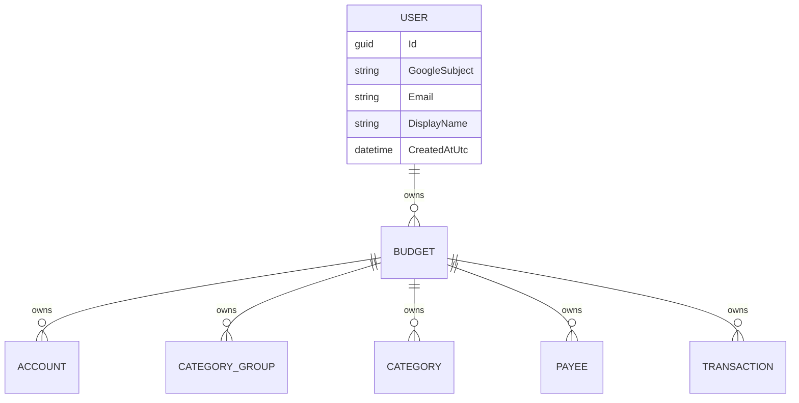
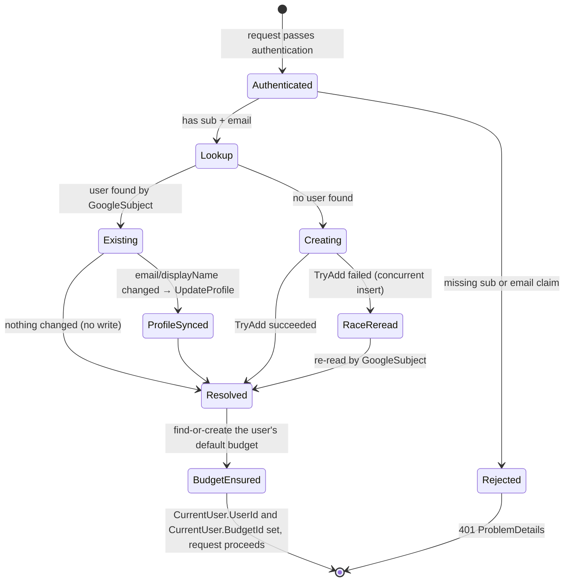

# Users & Ownership

## Table of Contents

- [Purpose](#purpose)
- [Key Entities](#key-entities)
- [Constraints](#constraints)
- [Business Rules & Invariants](#business-rules--invariants)
- [Workflows & State Transitions](#workflows--state-transitions)
- [Integration Points](#integration-points)
- [Edge Cases & Known Gotchas](#edge-cases--known-gotchas)

## Purpose

This area covers **who a user is** and how that identity comes to exist. Users are not registered
through a form — they are provisioned transparently from their Google sign-in on their first
authenticated request.

A user owns **Budgets** and nothing else. Everything else — accounts, category groups, categories,
payees, transactions — belongs to a budget, so **the budget, not the user, is the unit of tenancy.**
That invariant and the isolation rules that implement it live in [budgets.md](budgets.md); this area
does not duplicate them. What it does own is the identity, its claims, and the provisioning step that
resolves a Google principal into an internal user together with the ambient budget for the request.

## Key Entities

- **User** — the account owner. Identified externally by `GoogleSubject` (the Google OAuth `sub`
  claim, stable and immutable), internally by a `Guid Id`. Carries an `Email` and an optional
  `DisplayName`.
- **Email** — a value object wrapping the email string. Two emails are equal iff their values are
  equal (used to detect profile changes).

```mermaid
erDiagram
    USER ||--o{ BUDGET : owns
    BUDGET ||--o{ ACCOUNT : owns
    BUDGET ||--o{ CATEGORY_GROUP : owns
    BUDGET ||--o{ CATEGORY : owns
    BUDGET ||--o{ PAYEE : owns
    BUDGET ||--o{ TRANSACTION : owns
    USER {
        guid Id
        string GoogleSubject
        string Email
        string DisplayName
        datetime CreatedAtUtc
    }
```

## Constraints

### MUST

- **Data isolation is scoped to a budget, not to a user.** The MUST/MUST NOT rules that define it —
  every account, category group, category, payee and transaction belonging to exactly one budget,
  per-budget name uniqueness and ordering, no response combining budgets — are documented once, in
  [budgets.md](budgets.md#constraints). A user reaches their data only through the budget they own, so
  "a user can only see their own data" is a consequence of budget isolation rather than a separate
  rule.

- **A request must resolve to a real internal user and an ambient budget before it can touch data.**
  - **Why**: Handlers stamp and filter by `IBudgetContext.BudgetId`; without a resolved budget there
    is no tenant to scope to, and a default value would silently point at nothing.
  - **Enforced in**: `BudgetoidApp/Api/Infrastructure/UserProvisioningMiddleware.cs` populates both
    `CurrentUser.UserId` and `CurrentUser.BudgetId`; `HttpContextBudgetContext` throws
    `"The ambient budget for the current request has not been resolved."` if the budget id is still
    null.
    `CurrentUser.UserId` exists because the middleware needs a request-scoped home for the identity it
    just provisioned — no query filters by it.

- **An authenticated principal must carry `sub` and `email` claims.**
  - **Why**: `sub` is the stable identity key we upsert on; `email` is a required profile field.
    Without them we cannot provision a user.
  - **Enforced in**: `UserProvisioningMiddleware` returns `401` (ProblemDetails, "missing required
    claims") when either is absent.

### MUST NOT

- **A request MUST NOT reach data outside its ambient budget.** Stated and enforced in
  [budgets.md](budgets.md#must-not) — another budget's row resolves to `null` through the
  `BudgetIsolation` filter and surfaces as a 404, never a 403.

## Business Rules & Invariants

- **Rule**: A user — and its default budget — is provisioned (or their profile synced) idempotently
  on sign-in, keyed on the Google `sub`.
- **Why**: There is no registration step. The first authenticated request must create the internal
  user; subsequent requests must find the same one and keep email/display name fresh, without ever
  creating duplicates. The budget is part of the same step because "an account exists ⇒ it has its
  budget" is one idea, and splitting it would open a window where a user exists with no budget.
- **Enforced in**: `EnsureUserHandler` (`Application/Users/EnsureUser/EnsureUserHandler.cs`),
  invoked by `UserProvisioningMiddleware`; it returns `ProvisionedUser(UserId, BudgetId)`. The budget
  half of the rule is documented in [budgets.md](budgets.md).
- **Example**: A returning user whose Google display name changed from "Sam" to "Samantha" — on her
  next request the handler finds her by `sub`, sees the display name differs, and updates the
  profile. If nothing changed, no write happens.
- **Counterexample**: Keying on `email` instead of `sub` would break if the user changed their
  Google email — they'd be provisioned as a brand-new user and lose access to all their data.
- **Source**: `[SOURCE: code-audit]`

---

- **Rule**: `GoogleSubject` is immutable after creation; `Email` and `DisplayName` can change.
- **Why**: `sub` is the identity anchor — changing it would sever the user from their data. Email
  and name are mutable profile attributes that Google may update.
- **Enforced in**: `User.UpdateProfile(email, displayName)` sets email/name only;
  `Domain/Users/User.cs` has no setter path for `GoogleSubject` after `Create`.
- **Example**: `UpdateProfile` re-runs `Email.Create`, so a blanked email would be rejected.
- **Source**: `[SOURCE: code-audit]`

---

- **Rule**: An email must be present (non-blank, trimmed). Format is **not** validated.
- **Why**: The email comes from a trusted Google ID token, which has already verified it — a regex
  check would add friction without adding trust. Presence is still required because it's a
  displayed, required profile field.
- **Enforced in**: `Domain/Users/Email.cs` (`Email.Create`).
- **Source**: `[SOURCE: code-audit]`

## Workflows & State Transitions

**User provisioning on an authenticated request** (`UserProvisioningMiddleware` → `EnsureUserHandler`):

```mermaid
stateDiagram-v2
    [*] --> Authenticated : request passes authentication
    Authenticated --> Rejected : missing sub or email claim
    Authenticated --> Lookup : has sub + email
    Lookup --> Existing : user found by GoogleSubject
    Lookup --> Creating : no user found
    Existing --> ProfileSynced : email/displayName changed → UpdateProfile
    Existing --> Resolved : nothing changed (no write)
    ProfileSynced --> Resolved
    Creating --> Resolved : TryAdd succeeded
    Creating --> RaceReread : TryAdd failed (concurrent insert)
    RaceReread --> Resolved : re-read by GoogleSubject
    Resolved --> BudgetEnsured : find-or-create the user's default budget
    BudgetEnsured --> [*] : CurrentUser.UserId and CurrentUser.BudgetId set, request proceeds
    Rejected --> [*] : 401 ProblemDetails
```

| Transition | Triggered by | Validations |
|---|---|---|
| Authenticated → Rejected | Auth succeeds but claims missing | `sub` and `email` both required, else 401 |
| Lookup → Existing | User found by `GoogleSubject` | — |
| Existing → ProfileSynced | Email or display name differs | `UpdateProfile` re-validates email presence |
| Existing → Resolved | Nothing changed | Dirty check skips the write |
| Creating → Resolved | New user inserted | `User.Create` validates `sub`/email |
| Creating → RaceReread → Resolved | Unique-insert race | Re-read by `sub`; throws if still absent |
| Resolved → BudgetEnsured | Always, on every authenticated request | Find-or-create the default budget; heals a user left without one — see [budgets.md](budgets.md#workflows--state-transitions) |

## Integration Points

- **Google OAuth / OIDC**: identity comes from the Google ID token. The API trusts the `sub`,
  `email`, and optional `name` claims. The frontend attaches the **ID token** (not the access
  token) as the `Authorization: Bearer` header on API calls (see the client `AuthInterceptor`).
- **[Budgets](budgets.md)**: provisioning resolves the identity *and* the ambient budget in one step.
  Everything a user can see hangs off that budget, so all tenancy rules — stamping, filtering, name
  uniqueness, the 404 behaviour — are documented there.
- **All other domain areas**: Accounts, Transactions, Payees, Category Groups, and Categories are
  budget-scoped, not user-scoped. They carry no `UserId` at all; the only owner link in the schema is
  `Budget.UserId`.

## Edge Cases & Known Gotchas

- **Concurrent first-request race**: two simultaneous first requests for the same new user can both
  miss on lookup and race to insert. The loser of the unique-index race catches the failure and
  re-reads by `sub` rather than erroring. Do not "simplify" `EnsureUserHandler` by dropping the
  re-read — it is what makes provisioning safe under concurrency.
- **`IBudgetContext` is optional on the DbContext**: design-time/migration/seeding paths construct the
  context without a resolved budget. That's intentional — those paths never query the
  isolation-filtered entities. Application request paths always have a resolved budget.
- **404, not 403, for a row in another budget**: because isolation is a query filter, "belongs to
  another budget" is indistinguishable from "doesn't exist". This is deliberate (it avoids leaking the
  existence of other tenants' records), so don't add a separate 403 path.
